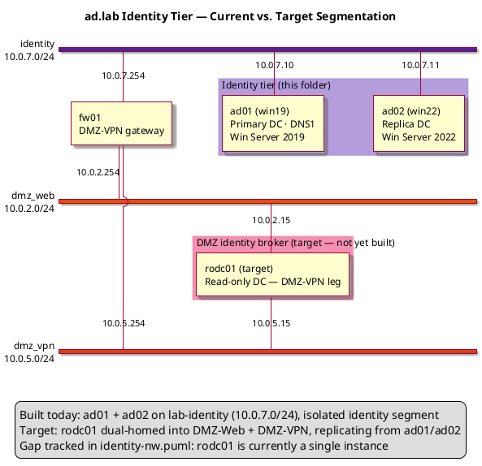

# ad.lab Domain Controllers — Phase 3 Reference Guide

## Forest Root + Replica DC, and Unattended Promotion

---

## 1. Overview

Phase 3 stands up the identity tier for the ad.lab domain: a forest-root DC (ad01) followed by a replica DC (ad02) for redundancy and load distribution. Phase 4 (PKI, `../pki/README.md`) and Phase 5/6 (services, DMZ) build on top of this tier.

| Component   | Hostname    | IP Address | Role                                    | OS                            |
| ----------- | ----------- | ---------- | ---------------------------------------- | ------------------------------ |
| Primary DC  | ad01.ad.lab | 10.0.7.10  | Forest root, AD DS, DNS1                 | Windows Server 2019 Core       |
| Replica DC  | ad02.ad.lab | 10.0.7.11  | Replica DC, AD DS, DNS secondary         | Windows Server 2022 Core       |

| Setting          | Value    |
| ---------------- | -------- |
| Domain (FQDN)    | ad.lab   |
| NetBIOS name     | ADLAB    |
| Forest/Domain mode | WinThreshold (2016) |
| Network          | lab-identity (10.0.7.0/24) |
| Gateway          | 10.0.7.254 |

---

## 2. VM Creation

Both DCs are built the same way the rest of this repo builds Windows VMs: unattended OS install via `virt-install` + a rebuilt install ISO carrying `autounattend.xml` and the VirtIO NetKVM driver, reusing the golden answer files already in `../win19/` and `../win22/`. VM naming/IP is generic at this stage (`WIN19`/`WIN22`, placeholder IP) — the Phase 3 scripts in Section 6 do the actual rename to `AD01`/`AD02` and set the final static IP once the guest is up.

| Script               | Base image                | VM name | os-variant | Disk  | RAM    | vCPUs |
| -------------------- | -------------------------- | ------- | ---------- | ----- | ------ | ----- |
| `create-ad01-vm.sh`  | Windows Server 2019 (../win19/) | ad01    | win2k19    | 50 GB | 2048 MB | 2     |
| `create-ad02-vm.sh`  | Windows Server 2022 (../win22/) | ad02    | win2k22    | 50 GB | 2048 MB | 2     |

Requirements on the libvirt host: `p7zip-full`, `genisoimage`, `qemu-utils`, `virtinst`, `ovmf`.

```bash
apt install p7zip-full genisoimage qemu-utils virtinst ovmf
```

### 2.1 create-ad01-vm.sh

```bash
#!/bin/bash
# create-ad01-vm.sh
# Creates the ad01 VM (Windows Server 2019 Core) — unattended OS install.
# Reuses the golden autounattend.xml + NetKVM driver set from ../win19/.
# After first boot, run phase3-ad01.ps1 (or phase3-ad01-unattended.ps1)
# inside the guest to rename it to AD01, set its static IP, and promote
# it as the ad.lab forest root.
#
# Requirements: p7zip-full, genisoimage, qemu-utils, virtinst, ovmf
#   apt install p7zip-full genisoimage qemu-utils virtinst ovmf
#
# Run from inside the dcs/ folder:
#   ./create-ad01-vm.sh

set -e

VM_NAME="${1:-ad01}"
ORIG_ISO="/home/huber/Downloads/en-us_windows_server_2019_x64_dvd_f9475476.iso"
ANSWER_FILE="$(pwd)/../win19/autounattend.xml"
NEW_ISO="$(pwd)/${VM_NAME}-unattended.iso"
WORK_DIR="/tmp/${VM_NAME}-iso-work"
DISK_PATH="/vms/${VM_NAME}.qcow2"
NETKVM_SRC="$(pwd)/../win19/NetKVM"
NETKVM_DST="$WORK_DIR/NetKVM"
DISK_SIZE=50
RAM=2048
VCPUS=2
NETWORK="lab-identity"

# Dependency check
for cmd in 7z genisoimage qemu-img virt-install; do
  command -v "$cmd" &>/dev/null || {
    echo "ERROR: '$cmd' not found."
    echo "  Install: apt install p7zip-full genisoimage qemu-utils virtinst ovmf"
    exit 1
  }
done

[ ! -f "$ORIG_ISO" ]    && echo "ERROR: ISO not found: $ORIG_ISO"            && exit 1
[ ! -f "$ANSWER_FILE" ] && echo "ERROR: Answer file not found: $ANSWER_FILE (expected in ../win19/)" && exit 1

# Check OVMF firmware is available for UEFI
if [ ! -f /usr/share/OVMF/OVMF_CODE.fd ] && [ ! -f /usr/share/ovmf/OVMF.fd ]; then
  echo "ERROR: OVMF not found. Install with: apt install ovmf"
  exit 1
fi

mkdir -p /vms

# 1. Extract ISO
echo "[1/5] Extracting ISO..."
rm -rf "$WORK_DIR" && mkdir -p "$WORK_DIR"
7z x "$ORIG_ISO" -o"$WORK_DIR" -y > /dev/null

# 2. Inject answer file + VirtIO network driver
echo "[2/5] Injecting autounattend.xml and NetKVM VirtIO driver..."
cp "$ANSWER_FILE" "$WORK_DIR/autounattend.xml"

if [ ! -d "$NETKVM_SRC" ]; then
  echo "ERROR: NetKVM driver folder not found at $NETKVM_SRC"
  echo "  Download virtio-win drivers from https://fedorapeople.org/groups/virt/virtio-win/direct-downloads/stable-virtio/"
  echo "  and place the NetKVM/w2k19/amd64/ contents in ../win19/NetKVM/"
  exit 1
fi
cp -r "$NETKVM_SRC" "$NETKVM_DST"

# 3. Rebuild bootable ISO
echo "[3/5] Rebuilding ISO at $NEW_ISO ..."
genisoimage \
  -iso-level 4 \
  -l -R -J \
  -no-emul-boot \
  -b boot/etfsboot.com \
  -boot-load-size 8 \
  -boot-load-seg 0x07C0 \
  -eltorito-alt-boot \
  -e efi/microsoft/boot/efisys_noprompt.bin \
  -no-emul-boot \
  -allow-limited-size \
  -relaxed-filenames \
  -o "$NEW_ISO" \
  "$WORK_DIR"

# 4. Clean up old VM, create disk, launch with UEFI
echo "[4/5] Creating disk and launching VM (UEFI)..."
virsh destroy  "$VM_NAME" 2>/dev/null || true
virsh undefine "$VM_NAME" --nvram 2>/dev/null || true
rm -f "$DISK_PATH"

qemu-img create -f qcow2 "$DISK_PATH" "${DISK_SIZE}G"

virt-install \
  --name           "$VM_NAME" \
  --ram            "$RAM" \
  --vcpus          "$VCPUS" \
  --os-variant     win2k19 \
  --machine        q35 \
  --boot           uefi \
  --disk           path="$DISK_PATH",format=qcow2,bus=sata \
  --cdrom          "$NEW_ISO" \
  --network        network="$NETWORK",model=virtio \
  --graphics       spice \
  --video          qxl \
  --noautoconsole

# 5. Clean WORK_DIR
echo "[5/5] Clean WORK_DIR"
rm -rf "$WORK_DIR"

echo ""
echo "Done. VM '$VM_NAME' is installing unattended (UEFI/GPT)."
echo "  Watch progress : virt-viewer $VM_NAME"
echo "  Check state    : virsh domstate $VM_NAME"
echo "  List VMs       : virsh list --all"
echo ""
echo "NEXT: once Windows Setup finishes and the guest boots to a shell,"
echo "  copy phase3-ad01.ps1 (or phase3-ad01-unattended.ps1) in and run it"
echo "  to rename to AD01, set 10.0.7.10/24, and promote the ad.lab forest root."
```

### 2.2 create-ad02-vm.sh

```bash
#!/bin/bash
# create-ad02-vm.sh
# Creates the ad02 VM (Windows Server 2022 Core) — unattended OS install.
# Reuses the golden autounattend.xml + NetKVM driver set from ../win22/.
# After first boot, run phase3-ad02.ps1 (or phase3-ad02-unattended.ps1)
# inside the guest to rename it to AD02, set its static IP, and promote
# it as a replica DC for ad.lab.
#
# PREREQUISITE: ad01 must already be created and promoted (see
# create-ad01-vm.sh and phase3-ad01.ps1 / phase3-ad01-verify.ps1) before
# ad02 is promoted — VM creation itself has no such dependency.
#
# Requirements: p7zip-full, genisoimage, qemu-utils, virtinst, ovmf
#   apt install p7zip-full genisoimage qemu-utils virtinst ovmf
#
# Run from inside the dcs/ folder:
#   ./create-ad02-vm.sh

set -e

VM_NAME="${1:-ad02}"
ORIG_ISO="/home/huber/Downloads/en-us_windows_server_2022_updated_aug_2026_x64_dvd_f5ac19b0.iso"
ANSWER_FILE="$(pwd)/../win22/autounattend.xml"
NEW_ISO="$(pwd)/${VM_NAME}-unattended.iso"
WORK_DIR="/tmp/${VM_NAME}-iso-work"
DISK_PATH="/vms/${VM_NAME}.qcow2"
NETKVM_SRC="$(pwd)/../win22/NetKVM"
NETKVM_DST="$WORK_DIR/NetKVM"
DISK_SIZE=50
RAM=2048
VCPUS=2
NETWORK="lab-identity"

# Dependency check
for cmd in 7z genisoimage qemu-img virt-install; do
  command -v "$cmd" &>/dev/null || {
    echo "ERROR: '$cmd' not found."
    echo "  Install: apt install p7zip-full genisoimage qemu-utils virtinst ovmf"
    exit 1
  }
done

[ ! -f "$ORIG_ISO" ]    && echo "ERROR: ISO not found: $ORIG_ISO"            && exit 1
[ ! -f "$ANSWER_FILE" ] && echo "ERROR: Answer file not found: $ANSWER_FILE (expected in ../win22/)" && exit 1

# Check OVMF firmware is available for UEFI
if [ ! -f /usr/share/OVMF/OVMF_CODE.fd ] && [ ! -f /usr/share/ovmf/OVMF.fd ]; then
  echo "ERROR: OVMF not found. Install with: apt install ovmf"
  exit 1
fi

mkdir -p /vms

# 1. Extract ISO
echo "[1/5] Extracting ISO..."
rm -rf "$WORK_DIR" && mkdir -p "$WORK_DIR"
7z x "$ORIG_ISO" -o"$WORK_DIR" -y > /dev/null

# 2. Inject answer file + VirtIO network driver
echo "[2/5] Injecting autounattend.xml and NetKVM VirtIO driver..."
cp "$ANSWER_FILE" "$WORK_DIR/autounattend.xml"

if [ ! -d "$NETKVM_SRC" ]; then
  echo "ERROR: NetKVM driver folder not found at $NETKVM_SRC"
  echo "  Mount virtio-win.iso and copy the NetKVM/w2k22/amd64/ contents into ../win22/NetKVM/"
  exit 1
fi
cp -r "$NETKVM_SRC" "$NETKVM_DST"

# 3. Rebuild bootable ISO
echo "[3/5] Rebuilding ISO at $NEW_ISO ..."
genisoimage \
  -iso-level 4 \
  -l -R -J \
  -no-emul-boot \
  -b boot/etfsboot.com \
  -boot-load-size 8 \
  -boot-load-seg 0x07C0 \
  -eltorito-alt-boot \
  -e efi/microsoft/boot/efisys_noprompt.bin \
  -no-emul-boot \
  -allow-limited-size \
  -relaxed-filenames \
  -o "$NEW_ISO" \
  "$WORK_DIR"

# 4. Clean up old VM, create disk, launch with UEFI
echo "[4/5] Creating disk and launching VM (UEFI)..."
virsh destroy  "$VM_NAME" 2>/dev/null || true
virsh undefine "$VM_NAME" --nvram 2>/dev/null || true
rm -f "$DISK_PATH"

qemu-img create -f qcow2 "$DISK_PATH" "${DISK_SIZE}G"

virt-install \
  --name           "$VM_NAME" \
  --ram            "$RAM" \
  --vcpus          "$VCPUS" \
  --os-variant     win2k22 \
  --machine        q35 \
  --boot           uefi \
  --disk           path="$DISK_PATH",format=qcow2,bus=sata \
  --cdrom          "$NEW_ISO" \
  --network        network="$NETWORK",model=virtio \
  --graphics       spice \
  --video          qxl \
  --noautoconsole

# 5. Clean WORK_DIR
echo "[5/5] Clean WORK_DIR"
rm -rf "$WORK_DIR"

echo ""
echo "Done. VM '$VM_NAME' is installing unattended (UEFI/GPT)."
echo "  Watch progress : virt-viewer $VM_NAME"
echo "  Check state    : virsh domstate $VM_NAME"
echo "  List VMs       : virsh list --all"
echo ""
echo "NEXT: once Windows Setup finishes and the guest boots to a shell,"
echo "  copy phase3-ad02.ps1 (or phase3-ad02-unattended.ps1) in and run it"
echo "  to rename to AD02, set 10.0.7.11/24, and promote as a replica DC"
echo "  for ad.lab. ad01 must already be promoted and verified first."
```

---

## 3. Network Diagram

ad01/ad02 sit on the isolated `lab-identity` segment (`10.0.7.0/24`, gateway `10.0.7.254`, static-only, no DHCP). The diagram below (adapted from `identity-nw.puml`) shows the **target segmented architecture** this folder is building toward: an ACL-gated Identity/PKI network with a read-only DC (rodc01) exposing authentication to the DMZ tiers without placing a writable DC there.



See `identity-nw.puml` for the full lab topology (WAN, DMZ-Web, DMZ-VPN, Identity/PKI, MGMT) that this tier plugs into.

---

## 4. Prerequisites

Before running any Phase 3 script:

- ad01 and ad02 must be running Server Core (2019 and 2022 respectively) on the identity network, with no prior IP or hostname configuration
- `AD-Domain-Services` and `DNS` Windows features must be installable (no pending reboot blocking `Install-WindowsFeature`)
- Network path from ad02 to ad01 on 10.0.7.10 must be reachable before promoting ad02
- Know the DSRM (Directory Services Restore Mode) password ahead of time — this repo's lab convention is `Server2012!` for every VM, matching the PKI phase

---

## 5. Run Order

```
Step 0  host  create-ad01-vm.sh        Unattended OS install for ad01 (Windows Server 2019 Core)
        host  create-ad02-vm.sh        Unattended OS install for ad02 (Windows Server 2022 Core)
                                        Both can run in parallel — no dependency between them
                                        at the VM-creation stage. See Section 2.

Step 1  ad01  phase3-ad01.ps1          Rename, set static IP, install AD-Domain-Services + DNS,
                                        promote as forest root for ad.lab
                                        (reboots automatically on completion)

Step 2  ad01  phase3-ad01-verify.ps1   Run after reboot — confirms domain, forest, DNS, FSMO roles

Step 3  ad02  phase3-ad02.ps1          Rename (reboots), rerun, set static IP, verify ad01
                                        reachable, install AD-Domain-Services, promote as replica
                                        (prompts for ADLAB\Administrator credentials)

Step 4  ad02  phase3-ad02-verify.ps1   Run after reboot — confirms replication, DCDiag, DNS zones
```

---

## 6. Scripts

### 6.1 phase3-ad01.ps1 — Forest root promotion

Run on ad01. Sets a static IP, installs AD DS + DNS, and promotes the forest. Reboots automatically when done.

```powershell
# phase3-ad01.ps1
# Run on ad01 (win19) — Windows Server Core
# Promotes ad01 as primary DC and forest root for ad.lab
# IP: 10.0.7.10/24  GW: 10.0.7.254  DNS: 127.0.0.1

#Requires -RunAsAdministrator
Set-StrictMode -Version Latest
$ErrorActionPreference = 'Stop'

# ── Step 1 — Rename computer ──────────────────────────────────
Write-Host "[1/5] Renaming computer to ad01..." -ForegroundColor Cyan
$currentName = $env:COMPUTERNAME
if ($currentName -ne 'AD01') {
    Rename-Computer -NewName 'AD01' -Force
    Write-Host "     Renamed from $currentName to AD01. Will apply after reboot." -ForegroundColor Yellow
} else {
    Write-Host "     Already named AD01, skipping." -ForegroundColor Green
}

# ── Step 2 — Set static IP ────────────────────────────────────
Write-Host "[2/5] Configuring static IP 10.0.7.10/24..." -ForegroundColor Cyan
$ifIndex = (Get-NetAdapter | Where-Object { $_.Status -eq 'Up' }).InterfaceIndex

Remove-NetIPAddress -InterfaceIndex $ifIndex -Confirm:$false -ErrorAction SilentlyContinue
Remove-NetRoute -InterfaceIndex $ifIndex -Confirm:$false -ErrorAction SilentlyContinue

New-NetIPAddress `
    -InterfaceIndex  $ifIndex `
    -IPAddress       '10.0.7.10' `
    -PrefixLength    24 `
    -DefaultGateway  '10.0.7.254'

Set-DnsClientServerAddress `
    -InterfaceIndex  $ifIndex `
    -ServerAddresses '127.0.0.1','10.0.7.10'

Write-Host "     IP set. Verifying..." -ForegroundColor Green
Get-NetIPAddress -InterfaceIndex $ifIndex -AddressFamily IPv4 |
    Select-Object IPAddress, PrefixLength

# ── Step 3 — Install AD DS + DNS ─────────────────────────────
Write-Host "[3/5] Installing AD DS and DNS features..." -ForegroundColor Cyan
Install-WindowsFeature `
    -Name AD-Domain-Services, DNS `
    -IncludeManagementTools

Write-Host "     Features installed." -ForegroundColor Green

# ── Step 4 — Promote as forest root ──────────────────────────
Write-Host "[4/5] Promoting ad01 as forest root for ad.lab..." -ForegroundColor Cyan
Write-Host "     This will reboot automatically when complete." -ForegroundColor Yellow

$safeModePassword = ConvertTo-SecureString `
    'Server2012!' -AsPlainText -Force

Install-ADDSForest `
    -DomainName                    'ad.lab' `
    -DomainNetbiosName             'ADLAB' `
    -ForestMode                    'WinThreshold' `
    -DomainMode                    'WinThreshold' `
    -InstallDns `
    -SafeModeAdministratorPassword $safeModePassword `
    -NoRebootOnCompletion:$false `
    -Force

# ── Step 5 — Post-reboot verification (run after reboot) ──────
# After reboot run: .\phase3-ad01-verify.ps1
Write-Host "[5/5] Promotion triggered. VM will reboot..." -ForegroundColor Green
```

### 6.2 phase3-ad01-verify.ps1 — Post-promotion checks

```powershell
# phase3-ad01-verify.ps1
# Run on ad01 AFTER reboot to verify AD DS and DNS are healthy

#Requires -RunAsAdministrator
Set-StrictMode -Version Latest

Write-Host "=== ad01 post-promotion verification ===" -ForegroundColor Cyan

Write-Host "`n[1] Domain info:" -ForegroundColor Yellow
Get-ADDomain | Select-Object DNSRoot, NetBIOSName, DomainMode, Forest

Write-Host "`n[2] Forest info:" -ForegroundColor Yellow
Get-ADForest | Select-Object Name, ForestMode, SchemaMaster, DomainNamingMaster

Write-Host "`n[3] DC info:" -ForegroundColor Yellow
Get-ADDomainController | Select-Object Name, IPv4Address, IsGlobalCatalog, OperationMasterRoles

Write-Host "`n[4] DNS zones:" -ForegroundColor Yellow
Get-DnsServerZone | Select-Object ZoneName, ZoneType, IsDsIntegrated

Write-Host "`n[5] DCDiag summary:" -ForegroundColor Yellow
dcdiag /test:dns /test:replications /test:services /q

Write-Host "`n[6] DNS resolution test:" -ForegroundColor Yellow
Resolve-DnsName 'ad.lab' -Server '127.0.0.1' -ErrorAction SilentlyContinue

Write-Host "`n[7] FSMO roles:" -ForegroundColor Yellow
netdom query fsmo

Write-Host "`n=== Verification complete ===" -ForegroundColor Cyan
Write-Host "If all tests pass, run phase3-ad02.ps1 on ad02." -ForegroundColor Green
```

### 6.3 phase3-ad02.ps1 — Replica DC promotion

Run on ad02. **Prerequisite:** ad01 must be fully promoted and verified first. Reboots once for the rename (script exits and must be rerun manually), then prompts interactively for domain credentials before promoting.

```powershell
# phase3-ad02.ps1
# Run on ad02 (win22) — Windows Server Core
# Promotes ad02 as replica DC for ad.lab
# IP: 10.0.7.11/24  GW: 10.0.7.254  DNS: 10.0.7.10 (ad01)
# PREREQUISITE: ad01 must be fully promoted and verified first

#Requires -RunAsAdministrator
Set-StrictMode -Version Latest
$ErrorActionPreference = 'Stop'

# ── Step 1 — Rename computer ──────────────────────────────────
Write-Host "[1/5] Renaming computer to ad02..." -ForegroundColor Cyan
$currentName = $env:COMPUTERNAME
if ($currentName -ne 'AD02') {
    Rename-Computer -NewName 'AD02' -Force
    Write-Host "     Renamed from $currentName to AD02." -ForegroundColor Yellow
    Write-Host "     Rebooting to apply name..." -ForegroundColor Yellow
    Restart-Computer -Force
    # Script will stop here — rerun after reboot
    exit
} else {
    Write-Host "     Already named AD02, skipping." -ForegroundColor Green
}

# ── Step 2 — Set static IP ────────────────────────────────────
Write-Host "[2/5] Configuring static IP 10.0.7.11/24..." -ForegroundColor Cyan
$ifIndex = (Get-NetAdapter | Where-Object { $_.Status -eq 'Up' }).InterfaceIndex

Remove-NetIPAddress -InterfaceIndex $ifIndex -Confirm:$false -ErrorAction SilentlyContinue
Remove-NetRoute -InterfaceIndex $ifIndex -Confirm:$false -ErrorAction SilentlyContinue

New-NetIPAddress `
    -InterfaceIndex  $ifIndex `
    -IPAddress       '10.0.7.11' `
    -PrefixLength    24 `
    -DefaultGateway  '10.0.7.254'

# DNS must point to ad01 first, then itself as secondary
Set-DnsClientServerAddress `
    -InterfaceIndex  $ifIndex `
    -ServerAddresses '10.0.7.10','10.0.7.11'

Write-Host "     IP set." -ForegroundColor Green
Get-NetIPAddress -InterfaceIndex $ifIndex -AddressFamily IPv4 |
    Select-Object IPAddress, PrefixLength

# ── Step 3 — Verify connectivity to ad01 ─────────────────────
Write-Host "[3/5] Verifying connectivity to ad01..." -ForegroundColor Cyan

Start-Sleep -Seconds 10
$ping = Test-Connection -ComputerName '10.0.7.10' -Count 2 -Quiet -ErrorAction SilentlyContinue
if (-not $ping) {
    Write-Host "ERROR: Cannot reach ad01 at 10.0.7.10." -ForegroundColor Red
    Write-Host "       Ensure ad01 is running and promoted before continuing." -ForegroundColor Red
    exit 1
}

if (-not (Resolve-DnsName 'ad.lab' -Server '10.0.7.10' -ErrorAction SilentlyContinue)) {
    Write-Host "ERROR: DNS resolution for ad.lab failed via ad01." -ForegroundColor Red
    Write-Host "       Check DNS on ad01 is running correctly." -ForegroundColor Red
    exit 1
}

Write-Host "     ad01 reachable and DNS working." -ForegroundColor Green

# ── Step 4 — Install AD DS ────────────────────────────────────
Write-Host "[4/5] Installing AD DS feature..." -ForegroundColor Cyan
Install-WindowsFeature `
    -Name AD-Domain-Services `
    -IncludeManagementTools

Write-Host "     Feature installed." -ForegroundColor Green

# ── Step 5 — Promote as replica DC ───────────────────────────
Write-Host "[5/5] Promoting ad02 as replica DC for ad.lab..." -ForegroundColor Cyan
Write-Host "      Enter ADLAB\Administrator credentials when prompted." -ForegroundColor Yellow

$safeModePassword = ConvertTo-SecureString `
    'Server2012!' -AsPlainText -Force

$domainCred = Get-Credential -Message "Enter ADLAB\Administrator credentials" `
    -UserName 'ADLAB\Administrator'

Install-ADDSDomainController `
    -DomainName                    'ad.lab' `
    -InstallDns `
    -Credential                    $domainCred `
    -SafeModeAdministratorPassword $safeModePassword `
    -NoRebootOnCompletion:$false `
    -Force

Write-Host "Promotion triggered. VM will reboot..." -ForegroundColor Green
```

### 6.4 phase3-ad02-verify.ps1 — Replication checks

```powershell
# phase3-ad02-verify.ps1
# Run on ad02 AFTER reboot to verify replication with ad01

#Requires -RunAsAdministrator
Set-StrictMode -Version Latest

Write-Host "=== ad02 post-promotion verification ===" -ForegroundColor Cyan

Write-Host "`n[1] DC info:" -ForegroundColor Yellow
Get-ADDomainController | Select-Object Name, IPv4Address, IsGlobalCatalog

Write-Host "`n[2] Replication summary (run on ad01 or ad02):" -ForegroundColor Yellow
repadmin /replsummary

Write-Host "`n[3] Replication status:" -ForegroundColor Yellow
repadmin /showrepl

Write-Host "`n[4] All DCs in domain:" -ForegroundColor Yellow
Get-ADDomainController -Filter * | Select-Object Name, IPv4Address, Site

Write-Host "`n[5] DCDiag on ad02:" -ForegroundColor Yellow
dcdiag /test:replications /test:services /q

Write-Host "`n[6] DNS zones replicated:" -ForegroundColor Yellow
Get-DnsServerZone | Select-Object ZoneName, ZoneType, IsDsIntegrated

Write-Host "`n=== Phase 3 complete ===" -ForegroundColor Green
Write-Host "Both DCs are healthy. Proceed to Phase 4 (PKI tier)." -ForegroundColor Green
```

---

## 7. Unattended DC Promotion — Is It Possible?

**Yes.** The scripts above are only *semi-attended*: `phase3-ad01.ps1` requires a human to log back in and rerun `phase3-ad01-verify.ps1`, and `phase3-ad02.ps1` both stops for a manual rerun after the rename reboot and blocks on an interactive `Get-Credential` prompt. Neither limitation is inherent to AD DS — both can be removed.

### 7.1 Background: what happened to `dcpromo /unattend`?

Pre-2012 Windows Server supported a `dcpromo.exe` answer file (`[DCInstall]` section in an `unattend.txt`). `dcpromo.exe` itself is removed as of Windows Server 2012+; its unattended-install successor is simply calling `Install-ADDSForest` / `Install-ADDSDomainController` with every parameter supplied and no `Get-Credential`/`Read-Host` calls left in the script. That's the modern "answer file" — there's no separate DC-specific XML schema to author.

### 7.2 What actually blocks unattended execution here

| Blocker | Cause | Fix |
| ------- | ----- | --- |
| Reboot after rename | `Rename-Computer` requires a restart before AD DS setup can proceed | Re-launch the script automatically at next startup (Scheduled Task or RunOnce), tracked by a state file |
| Reboot after promotion | `Install-ADDSForest`/`Install-ADDSDomainController` reboot on completion | Same mechanism — the task checks the state file and runs the verification stage instead of re-promoting |
| Interactive credential prompt (ad02 only) | `Get-Credential` blocks until a human types a password | Supply a `PSCredential` built from a stored secret instead — see 6.3 |

### 7.3 Credential handling without a prompt

Two options, in increasing order of safety:

- **Plaintext in the script** (`ConvertTo-SecureString -AsPlainText`) — consistent with this repo's existing convention of a plaintext DSRM password (`Server2012!`) throughout Phase 3 and Phase 4. Fine for an isolated, disposable lab; not something to carry into anything internet-facing.
- **DPAPI-encrypted credential file** (`Export-Clixml` / `Import-Clixml`) — encrypt once, interactively, under the same local account and machine that will later decrypt it. Not portable between machines or accounts, but keeps the password out of the script body and off disk in plaintext.

### 7.4 Reboot persistence pattern

Both provided scripts (`phase3-ad01-unattended.ps1`, `phase3-ad02-unattended.ps1`) use the same pattern:

1. A small integer in `C:\ProvisionState\<host>.stage` tracks progress (0 = not started, 1 = renamed, 2 = promoted, 3 = verified).
2. A Scheduled Task (`AtStartup`, runs as `SYSTEM`, no logon required) re-invokes the same script file on every boot.
3. The script reads its stage, does the next piece of work, advances the stage, and either reboots (letting the task pick it back up) or — at stage 3 — unregisters its own task and stops.

This is the same idea the OS-level `autounattend.xml` files in `../win19/` and `../win22/` already use for `FirstLogonCommands` (see `win19/autounattend.xml`) — just extended past the point where the base OS install hands off, so the whole chain from blank disk to promoted, verified DC needs zero console interaction.

### 7.5 phase3-ad01-unattended.ps1 — forest root, no prompts

```powershell
# phase3-ad01-unattended.ps1
# Run ONCE on ad01 (win19) — Windows Server Core
# Fully unattended version of phase3-ad01.ps1 + phase3-ad01-verify.ps1
# Survives both reboots (rename, promotion) with no console interaction.
# IP: 10.0.7.10/24  GW: 10.0.7.254  DNS: 127.0.0.1
#
# HOW IT WORKS
#   A state file (C:\ProvisionState\ad01.stage) tracks progress across
#   reboots. A scheduled task re-launches this same script as SYSTEM at
#   every startup until stage 3 (verified) is reached, then the task
#   deletes itself. Nothing here waits on a human.

#Requires -RunAsAdministrator
Set-StrictMode -Version Latest
$ErrorActionPreference = 'Stop'

$stateDir   = 'C:\ProvisionState'
$stateFile  = Join-Path $stateDir 'ad01.stage'
$taskName   = 'Phase3-AD01-Continue'
$scriptPath = $MyInvocation.MyCommand.Path
$logFile    = Join-Path $stateDir 'ad01-unattended.log'

New-Item -ItemType Directory -Path $stateDir -Force | Out-Null
Start-Transcript -Path $logFile -Append | Out-Null

function Get-Stage {
    if (Test-Path $stateFile) { return [int](Get-Content $stateFile) }
    return 0
}
function Set-Stage([int]$n) { Set-Content -Path $stateFile -Value $n }

function Register-ContinueTask {
    # Runs at every startup as SYSTEM, no logon required, no user prompt.
    $action    = New-ScheduledTaskAction -Execute 'powershell.exe' `
        -Argument "-NoProfile -ExecutionPolicy Bypass -File `"$scriptPath`""
    $trigger   = New-ScheduledTaskTrigger -AtStartup
    $principal = New-ScheduledTaskPrincipal -UserId 'SYSTEM' -LogonType ServiceAccount -RunLevel Highest
    $settings  = New-ScheduledTaskSettingsSet -AllowStartIfOnBatteries -DontStopIfGoingOnBatteries -StartWhenAvailable
    Register-ScheduledTask -TaskName $taskName -Action $action -Trigger $trigger `
        -Principal $principal -Settings $settings -Force | Out-Null
}

function Unregister-ContinueTask {
    Unregister-ScheduledTask -TaskName $taskName -Confirm:$false -ErrorAction SilentlyContinue
}

$stage = Get-Stage
Write-Host "=== ad01 unattended provisioning — resuming at stage $stage ===" -ForegroundColor Cyan

if ($stage -eq 0) {
    # ── Stage 0 — rename, schedule continuation, reboot ────────
    Write-Host "[Stage 0] Renaming computer to AD01..." -ForegroundColor Cyan
    Register-ContinueTask
    if ($env:COMPUTERNAME -ne 'AD01') {
        Rename-Computer -NewName 'AD01' -Force
    }
    Set-Stage 1
    Write-Host "     Rebooting to apply hostname..." -ForegroundColor Yellow
    Stop-Transcript | Out-Null
    Restart-Computer -Force
    exit
}

if ($stage -eq 1) {
    # ── Stage 1 — static IP, features, promote forest root ─────
    Write-Host "[Stage 1] Configuring static IP 10.0.7.10/24..." -ForegroundColor Cyan
    $ifIndex = (Get-NetAdapter | Where-Object { $_.Status -eq 'Up' }).InterfaceIndex
    Remove-NetIPAddress -InterfaceIndex $ifIndex -Confirm:$false -ErrorAction SilentlyContinue
    Remove-NetRoute -InterfaceIndex $ifIndex -Confirm:$false -ErrorAction SilentlyContinue
    New-NetIPAddress -InterfaceIndex $ifIndex -IPAddress '10.0.7.10' `
        -PrefixLength 24 -DefaultGateway '10.0.7.254'
    Set-DnsClientServerAddress -InterfaceIndex $ifIndex -ServerAddresses '127.0.0.1','10.0.7.10'

    Write-Host "[Stage 1] Installing AD DS and DNS features..." -ForegroundColor Cyan
    Install-WindowsFeature -Name AD-Domain-Services, DNS -IncludeManagementTools

    Write-Host "[Stage 1] Promoting ad01 as forest root for ad.lab..." -ForegroundColor Cyan
    # Lab-only: plaintext DSRM password, same convention as the rest of this repo.
    # For anything beyond an isolated lab, pull this from a vault instead.
    $safeModePassword = ConvertTo-SecureString 'Server2012!' -AsPlainText -Force

    Install-ADDSForest `
        -DomainName                    'ad.lab' `
        -DomainNetbiosName             'ADLAB' `
        -ForestMode                    'WinThreshold' `
        -DomainMode                    'WinThreshold' `
        -InstallDns `
        -SafeModeAdministratorPassword $safeModePassword `
        -NoRebootOnCompletion:$false `
        -Force `
        -Confirm:$false

    Set-Stage 2
    # Install-ADDSForest reboots on its own; the scheduled task picks the
    # script back up automatically at next startup — nothing to do here.
    Stop-Transcript | Out-Null
    exit
}

if ($stage -eq 2) {
    # ── Stage 2 — post-promotion verification, then done ───────
    Write-Host "[Stage 2] Verifying AD DS and DNS..." -ForegroundColor Cyan
    Get-ADDomain | Select-Object DNSRoot, NetBIOSName, DomainMode, Forest | Out-Host
    Get-ADForest | Select-Object Name, ForestMode, SchemaMaster | Out-Host
    Get-ADDomainController | Select-Object Name, IPv4Address, IsGlobalCatalog | Out-Host
    dcdiag /test:dns /test:replications /test:services /q | Out-Host

    Set-Stage 3
    Unregister-ContinueTask
    Write-Host "=== ad01 unattended provisioning complete ===" -ForegroundColor Green
    Write-Host "Proceed to ad02: phase3-ad02-unattended.ps1" -ForegroundColor Green
}

Stop-Transcript | Out-Null
```

### 7.6 phase3-ad02-unattended.ps1 — replica DC, no prompts

```powershell
# phase3-ad02-unattended.ps1
# Run ONCE on ad02 (win22) — Windows Server Core
# Fully unattended version of phase3-ad02.ps1 + phase3-ad02-verify.ps1
# PREREQUISITE: ad01 must already show stage 3 (verified) before this runs.
# IP: 10.0.7.11/24  GW: 10.0.7.254  DNS: 10.0.7.10 (ad01)
#
# CREDENTIAL HANDLING
#   phase3-ad02.ps1 blocks on Get-Credential. To run unattended, provide
#   the ADLAB\Administrator password one of two ways:
#     A) Lab-only, matches this repo's existing convention of plaintext
#        DSRM passwords: hardcode via ConvertTo-SecureString -AsPlainText.
#     B) Slightly better: encrypt it once with Export-Clixml under the
#        SAME account/machine context that will later import it, then
#        read it back with Import-Clixml (DPAPI-protected at rest, but
#        only decryptable by that same local account on that same host).
#   This script uses (A) by default and shows (B) commented out below.

#Requires -RunAsAdministrator
Set-StrictMode -Version Latest
$ErrorActionPreference = 'Stop'

$stateDir   = 'C:\ProvisionState'
$stateFile  = Join-Path $stateDir 'ad02.stage'
$taskName   = 'Phase3-AD02-Continue'
$scriptPath = $MyInvocation.MyCommand.Path
$logFile    = Join-Path $stateDir 'ad02-unattended.log'

New-Item -ItemType Directory -Path $stateDir -Force | Out-Null
Start-Transcript -Path $logFile -Append | Out-Null

function Get-Stage {
    if (Test-Path $stateFile) { return [int](Get-Content $stateFile) }
    return 0
}
function Set-Stage([int]$n) { Set-Content -Path $stateFile -Value $n }

function Register-ContinueTask {
    $action    = New-ScheduledTaskAction -Execute 'powershell.exe' `
        -Argument "-NoProfile -ExecutionPolicy Bypass -File `"$scriptPath`""
    $trigger   = New-ScheduledTaskTrigger -AtStartup
    $principal = New-ScheduledTaskPrincipal -UserId 'SYSTEM' -LogonType ServiceAccount -RunLevel Highest
    $settings  = New-ScheduledTaskSettingsSet -AllowStartIfOnBatteries -DontStopIfGoingOnBatteries -StartWhenAvailable
    Register-ScheduledTask -TaskName $taskName -Action $action -Trigger $trigger `
        -Principal $principal -Settings $settings -Force | Out-Null
}

function Unregister-ContinueTask {
    Unregister-ScheduledTask -TaskName $taskName -Confirm:$false -ErrorAction SilentlyContinue
}

function Get-DomainCredential {
    # (A) Lab-only plaintext — remove this block and uncomment (B) for anything
    # more sensitive than an isolated lab.
    $securePwd = ConvertTo-SecureString 'Server2012!' -AsPlainText -Force
    return New-Object System.Management.Automation.PSCredential('ADLAB\Administrator', $securePwd)

    # (B) Encrypted-at-rest alternative — run once, interactively, BEFORE
    # kicking off the unattended flow, from the same account/host that will
    # later read it back:
    #   Get-Credential ADLAB\Administrator |
    #     Export-Clixml C:\ProvisionState\ad02-cred.xml
    # Then here:
    #   return Import-Clixml C:\ProvisionState\ad02-cred.xml
}

$stage = Get-Stage
Write-Host "=== ad02 unattended provisioning — resuming at stage $stage ===" -ForegroundColor Cyan

if ($stage -eq 0) {
    # ── Stage 0 — rename, schedule continuation, reboot ────────
    Write-Host "[Stage 0] Renaming computer to AD02..." -ForegroundColor Cyan
    Register-ContinueTask
    if ($env:COMPUTERNAME -ne 'AD02') {
        Rename-Computer -NewName 'AD02' -Force
    }
    Set-Stage 1
    Write-Host "     Rebooting to apply hostname..." -ForegroundColor Yellow
    Stop-Transcript | Out-Null
    Restart-Computer -Force
    exit
}

if ($stage -eq 1) {
    # ── Stage 1 — static IP, connectivity check, promote replica ─
    Write-Host "[Stage 1] Configuring static IP 10.0.7.11/24..." -ForegroundColor Cyan
    $ifIndex = (Get-NetAdapter | Where-Object { $_.Status -eq 'Up' }).InterfaceIndex
    Remove-NetIPAddress -InterfaceIndex $ifIndex -Confirm:$false -ErrorAction SilentlyContinue
    Remove-NetRoute -InterfaceIndex $ifIndex -Confirm:$false -ErrorAction SilentlyContinue
    New-NetIPAddress -InterfaceIndex $ifIndex -IPAddress '10.0.7.11' `
        -PrefixLength 24 -DefaultGateway '10.0.7.254'
    Set-DnsClientServerAddress -InterfaceIndex $ifIndex -ServerAddresses '10.0.7.10','10.0.7.11'

    Write-Host "[Stage 1] Verifying connectivity to ad01..." -ForegroundColor Cyan
    Start-Sleep -Seconds 10
    $ping = Test-Connection -ComputerName '10.0.7.10' -Count 4 -Quiet -ErrorAction SilentlyContinue
    if (-not $ping) {
        Write-Host "ERROR: Cannot reach ad01 at 10.0.7.10. Will retry on next startup." -ForegroundColor Red
        Stop-Transcript | Out-Null
        exit 1
    }
    if (-not (Resolve-DnsName 'ad.lab' -Server '10.0.7.10' -ErrorAction SilentlyContinue)) {
        Write-Host "ERROR: DNS resolution for ad.lab failed via ad01. Will retry on next startup." -ForegroundColor Red
        Stop-Transcript | Out-Null
        exit 1
    }

    Write-Host "[Stage 1] Installing AD DS feature..." -ForegroundColor Cyan
    Install-WindowsFeature -Name AD-Domain-Services -IncludeManagementTools

    Write-Host "[Stage 1] Promoting ad02 as replica DC for ad.lab..." -ForegroundColor Cyan
    $safeModePassword = ConvertTo-SecureString 'Server2012!' -AsPlainText -Force
    $domainCred       = Get-DomainCredential

    Install-ADDSDomainController `
        -DomainName                    'ad.lab' `
        -InstallDns `
        -Credential                    $domainCred `
        -SafeModeAdministratorPassword $safeModePassword `
        -NoRebootOnCompletion:$false `
        -Force `
        -Confirm:$false

    Set-Stage 2
    Stop-Transcript | Out-Null
    exit
}

if ($stage -eq 2) {
    # ── Stage 2 — post-promotion verification, then done ───────
    Write-Host "[Stage 2] Verifying replication..." -ForegroundColor Cyan
    Get-ADDomainController | Select-Object Name, IPv4Address, IsGlobalCatalog | Out-Host
    repadmin /replsummary | Out-Host
    Get-ADDomainController -Filter * | Select-Object Name, IPv4Address, Site | Out-Host
    dcdiag /test:replications /test:services /q | Out-Host

    Set-Stage 3
    Unregister-ContinueTask
    Write-Host "=== ad02 unattended provisioning complete — Phase 3 done ===" -ForegroundColor Green
}

Stop-Transcript | Out-Null
```

### 7.7 Chaining with the OS-level autounattend.xml

To go from a **blank VM to a promoted, verified DC with zero console interaction**, chain this with the OS install layer already used in `../win19/autounattend.xml` and `../win22/autounattend.xml`:

1. `autounattend.xml` installs the OS, sets hostname/IP, and runs `FirstLogonCommands` (see the pattern that installs OpenSSH in `win19/autounattend.xml`).
2. Add one more `FirstLogonCommand` that copies (or downloads) `phase3-ad0X-unattended.ps1` to disk and launches it once — that single launch is enough, since the script registers its own startup task for every subsequent reboot.
3. The chain then runs itself to completion: OS install → first boot → rename → reboot → promote → reboot → verify → task self-deletes.

That FirstLogonCommand looks like this, added to the existing `<FirstLogonCommands>` block:

```xml
<SynchronousCommand wcm:action="add">
  <Order>4</Order>
  <CommandLine>powershell.exe -NonInteractive -ExecutionPolicy Bypass -File "C:\Provision\phase3-ad01-unattended.ps1"</CommandLine>
  <Description>Bootstrap unattended DC promotion</Description>
  <RequiresUserInput>false</RequiresUserInput>
</SynchronousCommand>
```

(Place `phase3-ad01-unattended.ps1` at `C:\Provision\` beforehand — e.g. on the same driver ISO/share used for the `NetKVM` drivers — since `FirstLogonCommands` run before any network share you'd normally copy it from is guaranteed reachable.)

---

## 8. Verification Results

| Test                          | Result | Command                                   |
| ------------------------------ | ------ | ------------------------------------------ |
| Forest created                 | PASS   | `Get-ADForest`                              |
| Domain created                 | PASS   | `Get-ADDomain`                              |
| ad01 is Global Catalog + FSMO  | PASS   | `Get-ADDomainController`, `netdom query fsmo` |
| DNS zone `ad.lab` AD-integrated| PASS   | `Get-DnsServerZone`                         |
| ad02 replica promoted          | PASS   | `Get-ADDomainController -Filter *`          |
| Replication healthy            | PASS   | `repadmin /replsummary`                     |
| DCDiag clean                   | PASS   | `dcdiag /test:dns /test:replications /test:services /q` |

---

## 9. Quick Reference

### Key commands

| Command                                              | Run on        | Purpose                          |
| ----------------------------------------------------- | ------------- | --------------------------------- |
| `Get-ADDomain`                                        | ad01 or ad02  | Domain info                       |
| `Get-ADForest`                                        | ad01          | Forest info                       |
| `Get-ADDomainController -Filter *`                    | ad01 or ad02  | List all DCs                      |
| `repadmin /replsummary`                               | ad01 or ad02  | Replication health                |
| `repadmin /showrepl`                                  | ad01 or ad02  | Detailed replication status       |
| `dcdiag /test:dns /test:replications /test:services /q` | ad01 or ad02 | Full DC health check              |
| `netdom query fsmo`                                   | ad01          | FSMO role holders                 |
| `Get-ScheduledTask Phase3-AD0*-Continue`               | ad01 or ad02  | Check unattended-flow task status |
| `Get-Content C:\ProvisionState\ad0*.stage`             | ad01 or ad02  | Check unattended-flow progress    |

### Important file locations

| Path                                 | VM             | Contents                                  |
| ------------------------------------- | -------------- | ------------------------------------------ |
| `C:\ProvisionState\ad0*.stage`        | ad01, ad02     | Unattended-flow progress marker           |
| `C:\ProvisionState\ad0*-unattended.log` | ad01, ad02   | Transcript of the unattended run          |
| `C:\ProvisionState\ad02-cred.xml`     | ad02 (optional)| DPAPI-encrypted domain credential (7.3-B) |

---

_ad.lab Phase 3 Reference Guide — September 2026_
