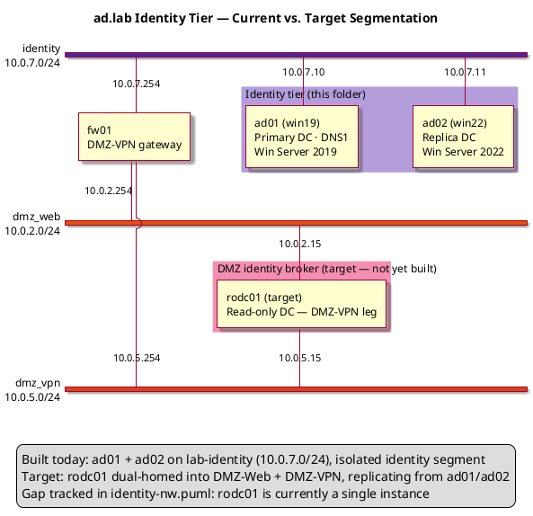

# ad.lab Domain Controllers — Phase 3 Reference Guide

## Forest Root + Replica DC, Fully Unattended

---

## 1. Overview

Phase 3 stands up the identity tier for the ad.lab domain: a forest-root DC (ad01) followed by a replica DC (ad02) for redundancy and load distribution. Phase 4 (PKI, `../pki/README.md`) and Phase 5/6 (services, DMZ) build on top of this tier.

| Component   | Hostname    | IP Address | Role                                    | OS                            |
| ----------- | ----------- | ---------- | ---------------------------------------- | ------------------------------ |
| Primary DC  | ad01.ad.lab | 10.0.7.10  | Forest root, AD DS, DNS1                 | Windows Server 2019 Core       |
| Replica DC  | ad02.ad.lab | 10.0.7.11  | Replica DC, AD DS, DNS secondary         | Windows Server 2022 Core       |

| Setting          | Value    |
| ---------------- | -------- |
| Domain (FQDN)    | ad.lab   |
| NetBIOS name     | ADLAB    |
| Forest/Domain mode | WinThreshold (2016) |
| Network          | lab-identity (10.0.7.0/24) |
| Gateway          | 10.0.7.254 |

**This folder is fully self-contained and fully unattended.** Running `create-ad01-vm.sh` takes a blank VM all the way to a verified, promoted forest root with zero console interaction, and `create-ad02-vm.sh` does the same for the replica once ad01 is up. Nobody needs to log into either guest at any point.

---

## 2. VM Creation

Both DCs are built the same way the rest of this repo builds Windows VMs: unattended OS install via `virt-install` + a rebuilt install ISO carrying a custom `autounattend.xml`, the VirtIO NetKVM driver, and a `Provision\` folder with the DC-promotion PowerShell script. Unlike the rest of the repo, **the answer files here are local to `dcs/`** (`ad01-autounattend.xml`, `ad02-autounattend.xml`) instead of references to `../win19/autounattend.xml` / `../win22/autounattend.xml` — hostname (`AD01`/`AD02`) and the final static IP are baked straight into them, so there's no post-install rename/reboot step left to run by hand. Only the NetKVM driver folders are still pulled from `../win19/NetKVM` and `../win22/NetKVM`, since those are just the shared vendor driver binaries, not answer-file references.

| Script               | Answer file (local)        | Base ISO                         | VM name | os-variant | Disk  | RAM    | vCPUs |
| -------------------- | --------------------------- | --------------------------------- | ------- | ---------- | ----- | ------ | ----- |
| `create-ad01-vm.sh`  | `ad01-autounattend.xml`     | Windows Server 2019               | ad01    | win2k19    | 50 GB | 2048 MB | 2     |
| `create-ad02-vm.sh`  | `ad02-autounattend.xml`     | Windows Server 2022               | ad02    | win2k22    | 50 GB | 2048 MB | 2     |

Requirements on the libvirt host: `p7zip-full`, `genisoimage`, `qemu-utils`, `virtinst`, `ovmf`.

```bash
apt install p7zip-full genisoimage qemu-utils virtinst ovmf
```

### 2.1 What the answer files bake in

`ad01-autounattend.xml` and `ad02-autounattend.xml` are forks of the `win19`/`win22` golden copies with three differences:

1. `ComputerName` is `AD01` / `AD02` directly — no `Rename-Computer` + reboot needed afterward.
2. The static IP is `10.0.7.10/24` / `10.0.7.11/24` on `lab-identity`, gateway `10.0.7.254` (ad02's DNS search order also points at ad01 first, itself second).
   - ad01's pre-promotion resolver is Cloudflare-only (`1.1.1.1`, `1.0.0.1`) rather than a DC address, since none exists yet at that point.
   - Upstream DNS for anything outside `ad.lab` is Cloudflare (`1.1.1.1` + `1.0.0.1`) on **both** DCs. This is set explicitly via `Set-DnsServerForwarder -IPAddress '1.1.1.1','1.0.0.1' -UseRootHint $false` in Stage 1 of each `phase3-ad0X-unattended.ps1`, rather than left to whatever `Install-ADDSForest`/`Install-ADDSDomainController -InstallDns` happens to inherit from the pre-promotion NIC resolver — ad02 in particular has no external addresses on its NIC to inherit from (its resolver list is the two DCs), so without this explicit step it would silently fall back to root hints and diverge from ad01. Verify with `Get-DnsServerForwarder` on either DC.
3. `FirstLogonCommands` gains two extra steps beyond the usual OpenSSH bootstrap:
   - copy `D:\Provision\phase3-ad0X-unattended.ps1` (staged onto the ISO by the `create-ad0X-vm.sh` script) to `C:\Provision\`
   - launch it once with `powershell.exe -File C:\Provision\phase3-ad0X-unattended.ps1`

That single launch is enough — the script re-arms itself via a scheduled task across every reboot the promotion process triggers. See Section 7.

### 2.2 create-ad01-vm.sh

```bash
#!/bin/bash
# create-ad01-vm.sh
# Creates the ad01 VM (Windows Server 2019 Core) — fully unattended OS
# install AND fully unattended AD DS forest-root promotion.
#
# Unlike the earlier version of this script, the answer file is a custom
# copy that lives in this folder (ad01-autounattend.xml) instead of a
# reference to ../win19/autounattend.xml — hostname (AD01) and static IP
# (10.0.7.10/24) are baked in directly, and its FirstLogonCommands stage
# phase3-ad01-unattended.ps1 onto the guest and launch it once. From there
# the guest promotes itself to the ad.lab forest root with zero console
# interaction: OS install -> first boot -> AD DS/DNS install -> promote ->
# reboot -> verify. See dcs/README.md section 7 for how the chain works.
#
# Requirements: p7zip-full, genisoimage, qemu-utils, virtinst, ovmf
#   apt install p7zip-full genisoimage qemu-utils virtinst ovmf
#
# Run from inside the dcs/ folder:
#   ./create-ad01-vm.sh

set -e

VM_NAME="${1:-ad01}"
ORIG_ISO="/home/huber/Downloads/en-us_windows_server_2019_x64_dvd_f9475476.iso"
ANSWER_FILE="$(pwd)/ad01-autounattend.xml"
PROVISION_SCRIPT="$(pwd)/phase3-ad01-unattended.ps1"
NEW_ISO="$(pwd)/${VM_NAME}-unattended.iso"
WORK_DIR="/tmp/${VM_NAME}-iso-work"
DISK_PATH="/vms/${VM_NAME}.qcow2"
NETKVM_SRC="$(pwd)/../win19/NetKVM"
NETKVM_DST="$WORK_DIR/NetKVM"
DISK_SIZE=50
RAM=2048
VCPUS=2
NETWORK="lab-identity"

# Dependency check
for cmd in 7z genisoimage qemu-img virt-install; do
  command -v "$cmd" &>/dev/null || {
    echo "ERROR: '$cmd' not found."
    echo "  Install: apt install p7zip-full genisoimage qemu-utils virtinst ovmf"
    exit 1
  }
done

[ ! -f "$ORIG_ISO" ]         && echo "ERROR: ISO not found: $ORIG_ISO"                                   && exit 1
[ ! -f "$ANSWER_FILE" ]      && echo "ERROR: Answer file not found: $ANSWER_FILE (expected in dcs/)"      && exit 1
[ ! -f "$PROVISION_SCRIPT" ] && echo "ERROR: Provisioning script not found: $PROVISION_SCRIPT"            && exit 1

# Check OVMF firmware is available for UEFI
if [ ! -f /usr/share/OVMF/OVMF_CODE.fd ] && [ ! -f /usr/share/ovmf/OVMF.fd ]; then
  echo "ERROR: OVMF not found. Install with: apt install ovmf"
  exit 1
fi

mkdir -p /vms

# 1. Extract ISO
echo "[1/5] Extracting ISO..."
rm -rf "$WORK_DIR" && mkdir -p "$WORK_DIR"
7z x "$ORIG_ISO" -o"$WORK_DIR" -y > /dev/null

# 2. Inject answer file, NetKVM VirtIO driver, and the DC promotion script
echo "[2/5] Injecting ad01-autounattend.xml, NetKVM driver, and Provision\\phase3-ad01-unattended.ps1..."
cp "$ANSWER_FILE" "$WORK_DIR/autounattend.xml"

if [ ! -d "$NETKVM_SRC" ]; then
  echo "ERROR: NetKVM driver folder not found at $NETKVM_SRC"
  echo "  Download virtio-win drivers from https://fedorapeople.org/groups/virt/virtio-win/direct-downloads/stable-virtio/"
  echo "  and place the NetKVM/w2k19/amd64/ contents in ../win19/NetKVM/"
  exit 1
fi
cp -r "$NETKVM_SRC" "$NETKVM_DST"

mkdir -p "$WORK_DIR/Provision"
cp "$PROVISION_SCRIPT" "$WORK_DIR/Provision/phase3-ad01-unattended.ps1"

# 3. Rebuild bootable ISO
echo "[3/5] Rebuilding ISO at $NEW_ISO ..."
genisoimage \
  -iso-level 4 \
  -l -R -J \
  -no-emul-boot \
  -b boot/etfsboot.com \
  -boot-load-size 8 \
  -boot-load-seg 0x07C0 \
  -eltorito-alt-boot \
  -e efi/microsoft/boot/efisys_noprompt.bin \
  -no-emul-boot \
  -allow-limited-size \
  -relaxed-filenames \
  -o "$NEW_ISO" \
  "$WORK_DIR"

# 4. Clean up old VM, create disk, launch with UEFI
echo "[4/5] Creating disk and launching VM (UEFI)..."
virsh destroy  "$VM_NAME" 2>/dev/null || true
virsh undefine "$VM_NAME" --nvram 2>/dev/null || true
rm -f "$DISK_PATH"

qemu-img create -f qcow2 "$DISK_PATH" "${DISK_SIZE}G"

virt-install \
  --name           "$VM_NAME" \
  --ram            "$RAM" \
  --vcpus          "$VCPUS" \
  --os-variant     win2k19 \
  --machine        q35 \
  --boot           uefi \
  --disk           path="$DISK_PATH",format=qcow2,bus=sata \
  --cdrom          "$NEW_ISO" \
  --network        network="$NETWORK",model=virtio \
  --graphics       spice \
  --video          qxl \
  --noautoconsole

# 5. Clean WORK_DIR
echo "[5/5] Clean WORK_DIR"
rm -rf "$WORK_DIR"

echo ""
echo "Done. VM '$VM_NAME' is installing unattended (UEFI/GPT)."
echo "  Watch progress : virt-viewer $VM_NAME"
echo "  Check state    : virsh domstate $VM_NAME"
echo "  List VMs       : virsh list --all"
echo ""
echo "NEXT: nothing to do by hand. Once Windows Setup finishes, ad01 renames"
echo "  itself to AD01, sets 10.0.7.10/24, installs AD DS + DNS, and promotes"
echo "  itself as the ad.lab forest root automatically, rebooting as needed."
echo "  Track progress from inside the guest:"
echo "    Get-Content C:\\ProvisionState\\ad01-unattended.log -Wait"
echo "    Get-Content C:\\ProvisionState\\ad01.stage   (0=installing AD DS, 1=promoted, 2=verified)"
echo "  Once ad01.stage reaches 2, run ./create-ad02-vm.sh."
```

### 2.3 create-ad02-vm.sh

```bash
#!/bin/bash
# create-ad02-vm.sh
# Creates the ad02 VM (Windows Server 2022 Core) — fully unattended OS
# install AND fully unattended replica-DC promotion.
#
# Unlike the earlier version of this script, the answer file is a custom
# copy that lives in this folder (ad02-autounattend.xml) instead of a
# reference to ../win22/autounattend.xml — hostname (AD02) and static IP
# (10.0.7.11/24) are baked in directly, and its FirstLogonCommands stage
# phase3-ad02-unattended.ps1 onto the guest and launch it once. From there
# the guest waits for ad01 on its own (retrying every 2 minutes, no manual
# rerun needed) and promotes itself as a replica DC once ad01 answers.
# See dcs/README.md section 7 for how the chain works.
#
# PREREQUISITE: ad01 should already be created and promoted (see
# create-ad01-vm.sh) before ad02 is promoted — VM creation itself has no
# such dependency, and ad02 will simply keep retrying until ad01 answers.
#
# Requirements: p7zip-full, genisoimage, qemu-utils, virtinst, ovmf
#   apt install p7zip-full genisoimage qemu-utils virtinst ovmf
#
# Run from inside the dcs/ folder:
#   ./create-ad02-vm.sh

set -e

VM_NAME="${1:-ad02}"
ORIG_ISO="/home/huber/Downloads/en-us_windows_server_2022_updated_aug_2026_x64_dvd_f5ac19b0.iso"
ANSWER_FILE="$(pwd)/ad02-autounattend.xml"
PROVISION_SCRIPT="$(pwd)/phase3-ad02-unattended.ps1"
NEW_ISO="$(pwd)/${VM_NAME}-unattended.iso"
WORK_DIR="/tmp/${VM_NAME}-iso-work"
DISK_PATH="/vms/${VM_NAME}.qcow2"
NETKVM_SRC="$(pwd)/../win22/NetKVM"
NETKVM_DST="$WORK_DIR/NetKVM"
DISK_SIZE=50
RAM=2048
VCPUS=2
NETWORK="lab-identity"

# Dependency check
for cmd in 7z genisoimage qemu-img virt-install; do
  command -v "$cmd" &>/dev/null || {
    echo "ERROR: '$cmd' not found."
    echo "  Install: apt install p7zip-full genisoimage qemu-utils virtinst ovmf"
    exit 1
  }
done

[ ! -f "$ORIG_ISO" ]         && echo "ERROR: ISO not found: $ORIG_ISO"                                   && exit 1
[ ! -f "$ANSWER_FILE" ]      && echo "ERROR: Answer file not found: $ANSWER_FILE (expected in dcs/)"      && exit 1
[ ! -f "$PROVISION_SCRIPT" ] && echo "ERROR: Provisioning script not found: $PROVISION_SCRIPT"            && exit 1

# Check OVMF firmware is available for UEFI
if [ ! -f /usr/share/OVMF/OVMF_CODE.fd ] && [ ! -f /usr/share/ovmf/OVMF.fd ]; then
  echo "ERROR: OVMF not found. Install with: apt install ovmf"
  exit 1
fi

mkdir -p /vms

# 1. Extract ISO
echo "[1/5] Extracting ISO..."
rm -rf "$WORK_DIR" && mkdir -p "$WORK_DIR"
7z x "$ORIG_ISO" -o"$WORK_DIR" -y > /dev/null

# 2. Inject answer file, NetKVM VirtIO driver, and the DC promotion script
echo "[2/5] Injecting ad02-autounattend.xml, NetKVM driver, and Provision\\phase3-ad02-unattended.ps1..."
cp "$ANSWER_FILE" "$WORK_DIR/autounattend.xml"

if [ ! -d "$NETKVM_SRC" ]; then
  echo "ERROR: NetKVM driver folder not found at $NETKVM_SRC"
  echo "  Mount virtio-win.iso and copy the NetKVM/w2k22/amd64/ contents into ../win22/NetKVM/"
  exit 1
fi
cp -r "$NETKVM_SRC" "$NETKVM_DST"

mkdir -p "$WORK_DIR/Provision"
cp "$PROVISION_SCRIPT" "$WORK_DIR/Provision/phase3-ad02-unattended.ps1"

# 3. Rebuild bootable ISO
echo "[3/5] Rebuilding ISO at $NEW_ISO ..."
genisoimage \
  -iso-level 4 \
  -l -R -J \
  -no-emul-boot \
  -b boot/etfsboot.com \
  -boot-load-size 8 \
  -boot-load-seg 0x07C0 \
  -eltorito-alt-boot \
  -e efi/microsoft/boot/efisys_noprompt.bin \
  -no-emul-boot \
  -allow-limited-size \
  -relaxed-filenames \
  -o "$NEW_ISO" \
  "$WORK_DIR"

# 4. Clean up old VM, create disk, launch with UEFI
echo "[4/5] Creating disk and launching VM (UEFI)..."
virsh destroy  "$VM_NAME" 2>/dev/null || true
virsh undefine "$VM_NAME" --nvram 2>/dev/null || true
rm -f "$DISK_PATH"

qemu-img create -f qcow2 "$DISK_PATH" "${DISK_SIZE}G"

virt-install \
  --name           "$VM_NAME" \
  --ram            "$RAM" \
  --vcpus          "$VCPUS" \
  --os-variant     win2k22 \
  --machine        q35 \
  --boot           uefi \
  --disk           path="$DISK_PATH",format=qcow2,bus=sata \
  --cdrom          "$NEW_ISO" \
  --network        network="$NETWORK",model=virtio \
  --graphics       spice \
  --video          qxl \
  --noautoconsole

# 5. Clean WORK_DIR
echo "[5/5] Clean WORK_DIR"
rm -rf "$WORK_DIR"

echo ""
echo "Done. VM '$VM_NAME' is installing unattended (UEFI/GPT)."
echo "  Watch progress : virt-viewer $VM_NAME"
echo "  Check state    : virsh domstate $VM_NAME"
echo "  List VMs       : virsh list --all"
echo ""
echo "NEXT: nothing to do by hand. Once Windows Setup finishes, ad02 renames"
echo "  itself to AD02, sets 10.0.7.11/24, waits for ad01 to answer (retrying"
echo "  every 2 minutes on its own), installs AD DS, and promotes itself as a"
echo "  replica DC for ad.lab automatically, rebooting as needed."
echo "  Track progress from inside the guest:"
echo "    Get-Content C:\\ProvisionState\\ad02-unattended.log -Wait"
echo "    Get-Content C:\\ProvisionState\\ad02.stage   (0=waiting/installing, 1=promoted, 2=verified)"
```

---

## 3. Network Diagram

ad01/ad02 sit on the isolated `lab-identity` segment (`10.0.7.0/24`, gateway `10.0.7.254`, static-only, no DHCP). The diagram below (adapted from `identity-nw.puml`) shows the **target segmented architecture** this folder is building toward: an ACL-gated Identity/PKI network with a read-only DC (rodc01) exposing authentication to the DMZ tiers without placing a writable DC there.



See `identity-nw.puml` for the full lab topology (WAN, DMZ-Web, DMZ-VPN, Identity/PKI, MGMT) that this tier plugs into.

---

## 4. Prerequisites

Before running either script:

- The base ISOs (`ORIG_ISO` in each `create-ad0X-vm.sh`) must exist at the paths hardcoded at the top of the script — edit those paths if your download location differs.
- `../win19/NetKVM/` and `../win22/NetKVM/` must contain the VirtIO NetKVM driver set (`w2k19`/`w2k22`, `amd64`) — see the `ERROR` messages in each script for the download source.
- `p7zip-full`, `genisoimage`, `qemu-utils`, `virtinst`, `ovmf` installed on the libvirt host (Section 2).
- The `lab-identity` libvirt network must already exist (`../nets/lab-identity.xml`).
- Nothing else — no DSRM password, no domain credentials, no manual OS knowledge is needed at run time. Both are hardcoded lab-only defaults (`Server2012!`) inside `phase3-ad01-unattended.ps1` / `phase3-ad02-unattended.ps1`, matching this repo's existing convention (Section 7.3).

---

## 5. Run Order

```
Step 0  host  ./create-ad01-vm.sh     Unattended OS install for ad01 (Windows Server 2019 Core).
                                       No further action needed: FirstLogonCommands in
                                       ad01-autounattend.xml stage and launch
                                       phase3-ad01-unattended.ps1, which installs AD DS + DNS
                                       and promotes ad01 as forest root for ad.lab, rebooting
                                       and resuming on its own until verified.

                                       Wait for C:\ProvisionState\ad01.stage to reach 2
                                       (or tail C:\ProvisionState\ad01-unattended.log) before
                                       moving to Step 1.

Step 1  host  ./create-ad02-vm.sh     Unattended OS install for ad02 (Windows Server 2022 Core).
                                       No further action needed: FirstLogonCommands in
                                       ad02-autounattend.xml stage and launch
                                       phase3-ad02-unattended.ps1, which waits for ad01 to
                                       answer (retrying every 2 minutes with no manual rerun),
                                       installs AD DS, and promotes ad02 as a replica DC,
                                       rebooting and resuming on its own until verified.

                                       Can be run any time after Step 0 — even immediately,
                                       since ad02 will simply keep retrying until ad01 is
                                       reachable. C:\ProvisionState\ad02.stage reaches 2 once
                                       replication is verified.
```

That's the entire flow — from blank VM to two verified, replicating domain controllers, with no console login, no `Get-Credential` prompt, and no manual rename/IP/reboot step on either guest.

---

## 6. Scripts

### 6.1 phase3-ad01-unattended.ps1 — forest root, no prompts

Launched once by `ad01-autounattend.xml`'s `FirstLogonCommands`. Hostname and static IP are already baked into the answer file, so this only has to install AD DS/DNS and promote — it survives the promotion reboot via a `SYSTEM` scheduled task keyed off a stage file.

```powershell
# phase3-ad01-unattended.ps1
# Launched ONCE by ad01-autounattend.xml's FirstLogonCommands on ad01 (win19)
# — Windows Server Core. Fully unattended: hostname (AD01) and static IP
# (10.0.7.10/24) are already baked into ad01-autounattend.xml, so this script
# only has to install AD DS + DNS and promote the forest. It survives the
# reboot Install-ADDSForest triggers with no console interaction.
#
# HOW IT WORKS
#   A state file (C:\ProvisionState\ad01.stage) tracks progress across
#   reboots. A scheduled task re-launches this same script as SYSTEM at
#   every startup until stage 2 (verified) is reached, then the task
#   deletes itself. Nothing here waits on a human.

#Requires -RunAsAdministrator
Set-StrictMode -Version Latest
$ErrorActionPreference = 'Stop'

$stateDir   = 'C:\ProvisionState'
$stateFile  = Join-Path $stateDir 'ad01.stage'
$taskName   = 'Phase3-AD01-Continue'
$scriptPath = $MyInvocation.MyCommand.Path
$logFile    = Join-Path $stateDir 'ad01-unattended.log'

New-Item -ItemType Directory -Path $stateDir -Force | Out-Null
Start-Transcript -Path $logFile -Append | Out-Null

function Get-Stage {
    if (Test-Path $stateFile) { return [int](Get-Content $stateFile) }
    return 0
}
function Set-Stage([int]$n) { Set-Content -Path $stateFile -Value $n }

function Register-ContinueTask {
    # Runs at every startup as SYSTEM, no logon required, no user prompt.
    $action    = New-ScheduledTaskAction -Execute 'powershell.exe' `
        -Argument "-NoProfile -ExecutionPolicy Bypass -File `"$scriptPath`""
    $trigger   = New-ScheduledTaskTrigger -AtStartup
    $principal = New-ScheduledTaskPrincipal -UserId 'SYSTEM' -LogonType ServiceAccount -RunLevel Highest
    $settings  = New-ScheduledTaskSettingsSet -AllowStartIfOnBatteries -DontStopIfGoingOnBatteries -StartWhenAvailable
    Register-ScheduledTask -TaskName $taskName -Action $action -Trigger $trigger `
        -Principal $principal -Settings $settings -Force | Out-Null
}

function Unregister-ContinueTask {
    Unregister-ScheduledTask -TaskName $taskName -Confirm:$false -ErrorAction SilentlyContinue
}

$stage = Get-Stage
Write-Host "=== ad01 unattended provisioning — resuming at stage $stage ===" -ForegroundColor Cyan

if ($stage -eq 0) {
    # ── Stage 0 — install AD DS + DNS, promote forest root ──────
    # Re-arm the continuation task BEFORE promoting, since
    # Install-ADDSForest reboots the machine on its own.
    Register-ContinueTask

    Write-Host "[Stage 0] Installing AD DS and DNS features..." -ForegroundColor Cyan
    Install-WindowsFeature -Name AD-Domain-Services, DNS -IncludeManagementTools

    Write-Host "[Stage 0] Promoting ad01 as forest root for ad.lab..." -ForegroundColor Cyan
    Write-Host "          This will reboot automatically when complete." -ForegroundColor Yellow

    # Lab-only: plaintext DSRM password, same convention as the rest of this repo.
    # For anything beyond an isolated lab, pull this from a vault instead.
    $safeModePassword = ConvertTo-SecureString 'Server2012!' -AsPlainText -Force

    Install-ADDSForest `
        -DomainName                    'ad.lab' `
        -DomainNetbiosName             'ADLAB' `
        -ForestMode                    'WinThreshold' `
        -DomainMode                    'WinThreshold' `
        -InstallDns `
        -SafeModeAdministratorPassword $safeModePassword `
        -NoRebootOnCompletion:$false `
        -Force `
        -Confirm:$false

    Set-Stage 1
    # Install-ADDSForest reboots on its own; the scheduled task picks the
    # script back up automatically at next startup — nothing to do here.
    Stop-Transcript | Out-Null
    exit
}

if ($stage -eq 1) {
    # ── Stage 1 — point DNS at the now-local DNS role, verify, done ─
    Write-Host "[Stage 1] Repointing DNS client to the local DNS role..." -ForegroundColor Cyan
    $ifIndex = (Get-NetAdapter | Where-Object { $_.Status -eq 'Up' }).InterfaceIndex
    Set-DnsClientServerAddress -InterfaceIndex $ifIndex -ServerAddresses '127.0.0.1', '10.0.7.10'

    Write-Host "[Stage 1] Pinning DNS Server forwarders to Cloudflare (1.1.1.1, 1.0.0.1)..." -ForegroundColor Cyan
    # Explicit rather than relying on whatever the pre-promotion NIC resolver
    # happened to be — makes the upstream DNS a deliberate, auditable setting
    # instead of an implicit side effect of Install-ADDSForest -InstallDns.
    Set-DnsServerForwarder -IPAddress '1.1.1.1', '1.0.0.1' -UseRootHint $false

    Write-Host "[Stage 1] Verifying AD DS and DNS..." -ForegroundColor Cyan
    Get-ADDomain | Select-Object DNSRoot, NetBIOSName, DomainMode, Forest | Out-Host
    Get-ADForest | Select-Object Name, ForestMode, SchemaMaster | Out-Host
    Get-ADDomainController | Select-Object Name, IPv4Address, IsGlobalCatalog | Out-Host
    Get-DnsServerForwarder | Out-Host
    dcdiag /test:dns /test:replications /test:services /q | Out-Host

    Set-Stage 2
    Unregister-ContinueTask
    Write-Host "=== ad01 unattended provisioning complete ===" -ForegroundColor Green
    Write-Host "ad02 can now be created (create-ad02-vm.sh) and will promote itself" -ForegroundColor Green
    Write-Host "automatically once it can reach ad01." -ForegroundColor Green
}

Stop-Transcript | Out-Null
```

### 6.2 phase3-ad02-unattended.ps1 — replica DC, no prompts

Launched once by `ad02-autounattend.xml`'s `FirstLogonCommands`. Waits for ad01 on a 2-minute repeating scheduled-task timer (not just `AtStartup`), so it needs no manual rerun even if ad01 isn't up yet when ad02 finishes installing.

```powershell
# phase3-ad02-unattended.ps1
# Launched ONCE by ad02-autounattend.xml's FirstLogonCommands on ad02 (win22)
# — Windows Server Core. Fully unattended: hostname (AD02) and static IP
# (10.0.7.11/24) are already baked into ad02-autounattend.xml, so this script
# only has to wait for ad01, install AD DS, and promote as a replica.
#
# HOW IT WORKS
#   A state file (C:\ProvisionState\ad02.stage) tracks progress. A scheduled
#   task re-launches this same script as SYSTEM both at every startup AND on
#   a 2-minute repeating timer, so it keeps retrying entirely on its own if
#   ad01 isn't reachable yet — no manual reboot or rerun required, and no
#   ordering dependency to babysit between create-ad01-vm.sh and
#   create-ad02-vm.sh. Once promoted, the task deletes itself.
#
# CREDENTIAL HANDLING
#   Install-ADDSDomainController normally blocks on Get-Credential. To stay
#   unattended, Get-DomainCredential below hardcodes the ADLAB\Administrator
#   password — lab-only, matching this repo's existing convention of a
#   plaintext DSRM password. For anything beyond an isolated lab, swap this
#   for an Import-Clixml credential exported once via Export-Clixml under
#   the same account/host (see Section 7.3).

#Requires -RunAsAdministrator
Set-StrictMode -Version Latest
$ErrorActionPreference = 'Stop'

$stateDir   = 'C:\ProvisionState'
$stateFile  = Join-Path $stateDir 'ad02.stage'
$taskName   = 'Phase3-AD02-Continue'
$scriptPath = $MyInvocation.MyCommand.Path
$logFile    = Join-Path $stateDir 'ad02-unattended.log'

New-Item -ItemType Directory -Path $stateDir -Force | Out-Null
Start-Transcript -Path $logFile -Append | Out-Null

function Get-Stage {
    if (Test-Path $stateFile) { return [int](Get-Content $stateFile) }
    return 0
}
function Set-Stage([int]$n) { Set-Content -Path $stateFile -Value $n }

function Register-ContinueTask {
    # Two triggers: AtStartup (survives reboots) AND a 2-minute repeating
    # timer (survives the case where ad01 simply isn't up yet and no reboot
    # is going to happen on its own) — this is what makes ad02 wait for ad01
    # without any human re-running anything.
    $action        = New-ScheduledTaskAction -Execute 'powershell.exe' `
        -Argument "-NoProfile -ExecutionPolicy Bypass -File `"$scriptPath`""
    $startupTrigger = New-ScheduledTaskTrigger -AtStartup
    $retryTrigger   = New-ScheduledTaskTrigger -Once -At (Get-Date) `
        -RepetitionInterval (New-TimeSpan -Minutes 2) `
        -RepetitionDuration ([TimeSpan]::MaxValue)
    $principal = New-ScheduledTaskPrincipal -UserId 'SYSTEM' -LogonType ServiceAccount -RunLevel Highest
    $settings  = New-ScheduledTaskSettingsSet -AllowStartIfOnBatteries -DontStopIfGoingOnBatteries `
        -StartWhenAvailable -MultipleInstances IgnoreNew
    Register-ScheduledTask -TaskName $taskName -Action $action -Trigger @($startupTrigger, $retryTrigger) `
        -Principal $principal -Settings $settings -Force | Out-Null
}

function Unregister-ContinueTask {
    Unregister-ScheduledTask -TaskName $taskName -Confirm:$false -ErrorAction SilentlyContinue
}

function Get-DomainCredential {
    # (A) Lab-only plaintext — remove this block and use (B) below for
    # anything more sensitive than an isolated lab.
    $securePwd = ConvertTo-SecureString 'Server2012!' -AsPlainText -Force
    return New-Object System.Management.Automation.PSCredential('ADLAB\Administrator', $securePwd)

    # (B) Encrypted-at-rest alternative — run once, interactively, BEFORE
    # kicking off the unattended flow, from the same account/host that will
    # later read it back:
    #   Get-Credential ADLAB\Administrator |
    #     Export-Clixml C:\ProvisionState\ad02-cred.xml
    # Then here:
    #   return Import-Clixml C:\ProvisionState\ad02-cred.xml
}

$stage = Get-Stage
Write-Host "=== ad02 unattended provisioning — resuming at stage $stage ===" -ForegroundColor Cyan

if ($stage -eq 0) {
    # ── Stage 0 — wait for ad01, install AD DS, promote replica ─
    Register-ContinueTask

    Write-Host "[Stage 0] Checking connectivity to ad01 (10.0.7.10)..." -ForegroundColor Cyan
    $ping = Test-Connection -ComputerName '10.0.7.10' -Count 2 -Quiet -ErrorAction SilentlyContinue
    $dns  = Resolve-DnsName 'ad.lab' -Server '10.0.7.10' -ErrorAction SilentlyContinue

    if (-not $ping -or -not $dns) {
        Write-Host "     ad01 not ready yet — will retry automatically in 2 minutes." -ForegroundColor Yellow
        Stop-Transcript | Out-Null
        exit
    }
    Write-Host "     ad01 reachable and DNS working." -ForegroundColor Green

    Write-Host "[Stage 0] Installing AD DS feature..." -ForegroundColor Cyan
    Install-WindowsFeature -Name AD-Domain-Services -IncludeManagementTools

    Write-Host "[Stage 0] Promoting ad02 as replica DC for ad.lab..." -ForegroundColor Cyan
    $safeModePassword = ConvertTo-SecureString 'Server2012!' -AsPlainText -Force
    $domainCred       = Get-DomainCredential

    Install-ADDSDomainController `
        -DomainName                    'ad.lab' `
        -InstallDns `
        -Credential                    $domainCred `
        -SafeModeAdministratorPassword $safeModePassword `
        -NoRebootOnCompletion:$false `
        -Force `
        -Confirm:$false

    Set-Stage 1
    Stop-Transcript | Out-Null
    exit
}

if ($stage -eq 1) {
    # ── Stage 1 — forwarders, verify replication, then done ─────
    Write-Host "[Stage 1] Pinning DNS Server forwarders to Cloudflare (1.1.1.1, 1.0.0.1)..." -ForegroundColor Cyan
    # ad02's pre-promotion resolver list is 10.0.7.10/10.0.7.11 (internal DCs),
    # so unlike ad01 there's nothing external for -InstallDns to have inherited
    # here — this must be set explicitly or ad02 falls back to root hints and
    # diverges from ad01's upstream behavior.
    Set-DnsServerForwarder -IPAddress '1.1.1.1', '1.0.0.1' -UseRootHint $false

    Write-Host "[Stage 1] Verifying replication..." -ForegroundColor Cyan
    Get-ADDomainController | Select-Object Name, IPv4Address, IsGlobalCatalog | Out-Host
    Get-DnsServerForwarder | Out-Host
    repadmin /replsummary | Out-Host
    Get-ADDomainController -Filter * | Select-Object Name, IPv4Address, Site | Out-Host
    dcdiag /test:replications /test:services /q | Out-Host

    Set-Stage 2
    Unregister-ContinueTask
    Write-Host "=== ad02 unattended provisioning complete — Phase 3 done ===" -ForegroundColor Green
}

Stop-Transcript | Out-Null
```

---

## 7. Unattended DC Promotion — How It Works

The two scripts above are fully unattended — no logon, no `Get-Credential` prompt, no manual reboot/rerun. This section documents the mechanics so the pattern is easy to extend to future phases.

### 7.1 Background: what happened to `dcpromo /unattend`?

Pre-2012 Windows Server supported a `dcpromo.exe` answer file (`[DCInstall]` section in an `unattend.txt`). `dcpromo.exe` itself is removed as of Windows Server 2012+; its unattended-install successor is simply calling `Install-ADDSForest` / `Install-ADDSDomainController` with every parameter supplied and no `Get-Credential`/`Read-Host` calls left in the script. That's the modern "answer file" — there's no separate DC-specific XML schema to author.

### 7.2 What used to block unattended execution, and how it's solved here

| Blocker | Cause | Fix used in this folder |
| ------- | ----- | --- |
| Rename + reboot | `Rename-Computer` requires a restart before AD DS setup can proceed | Eliminated — `ComputerName` is baked into `ad0X-autounattend.xml`'s `specialize` pass, so the guest is already named `AD01`/`AD02` at first boot |
| Static IP configuration | Doing it via `New-NetIPAddress` needs a login session | Eliminated — the TCP/IP and DNS-Client components in `ad0X-autounattend.xml`'s `specialize` pass set it during OS install |
| Reboot after promotion | `Install-ADDSForest`/`Install-ADDSDomainController` reboot on completion | A `SYSTEM` scheduled task (`AtStartup`) re-launches the same `phase3-ad0X-unattended.ps1` at every boot, tracked by a `C:\ProvisionState\ad0X.stage` file, until the verification stage is reached |
| ad02 needs ad01 up first | No inherent ordering guarantee between the two VM-creation scripts | `phase3-ad02-unattended.ps1`'s scheduled task also carries a 2-minute repeating trigger, so it retries connectivity to ad01 on its own without needing a reboot or a human to rerun anything |
| Interactive credential prompt (ad02 only) | `Get-Credential` blocks until a human types a password | `Get-DomainCredential` in `phase3-ad02-unattended.ps1` supplies a `PSCredential` built from a stored secret instead — see 7.3 |

### 7.3 Credential handling without a prompt

Two options, in increasing order of safety:

- **Plaintext in the script** (`ConvertTo-SecureString -AsPlainText`) — what both scripts use by default, consistent with this repo's existing convention of a plaintext DSRM password (`Server2012!`) throughout Phase 3 and Phase 4. Fine for an isolated, disposable lab; not something to carry into anything internet-facing.
- **DPAPI-encrypted credential file** (`Export-Clixml` / `Import-Clixml`) — encrypt once, interactively, under the same local account and machine that will later decrypt it. Not portable between machines or accounts, but keeps the password out of the script body and off disk in plaintext. Commented-out in `Get-DomainCredential` in `phase3-ad02-unattended.ps1` — uncomment and remove the plaintext block above it to switch.

### 7.4 Reboot persistence pattern

Both `phase3-ad01-unattended.ps1` and `phase3-ad02-unattended.ps1` use the same pattern:

1. A small integer in `C:\ProvisionState\<host>.stage` tracks progress (0 = not started, 1 = promoted [ad01] / promotion attempted [ad02], 2 = verified).
2. A scheduled task (`SYSTEM`, no logon required) re-invokes the same script file — on ad01 at every startup; on ad02 at every startup *and* every 2 minutes, since it also has to wait on an external dependency (ad01 being reachable) rather than just a local reboot.
3. The script reads its stage, does the next piece of work, advances the stage, and either exits (letting the next trigger pick it back up after a reboot Windows itself will do) or — once verified — unregisters its own task and stops.

### 7.5 How the OS-level autounattend.xml kicks it all off

`ad01-autounattend.xml` and `ad02-autounattend.xml` chain straight into this from `FirstLogonCommands`:

```xml
<SynchronousCommand wcm:action="add">
  <Order>4</Order>
  <CommandLine>cmd.exe /c if not exist C:\Provision mkdir C:\Provision &amp; copy /Y D:\Provision\phase3-ad01-unattended.ps1 C:\Provision\phase3-ad01-unattended.ps1</CommandLine>
  <Description>Stage AD DS promotion script from install media to C:\Provision</Description>
  <RequiresUserInput>false</RequiresUserInput>
</SynchronousCommand>
<SynchronousCommand wcm:action="add">
  <Order>5</Order>
  <CommandLine>powershell.exe -NonInteractive -ExecutionPolicy Bypass -File "C:\Provision\phase3-ad01-unattended.ps1"</CommandLine>
  <Description>Bootstrap unattended forest-root promotion (ad01)</Description>
  <RequiresUserInput>false</RequiresUserInput>
</SynchronousCommand>
```

(`create-ad0X-vm.sh` stages `phase3-ad0X-unattended.ps1` onto the rebuilt ISO's `Provision\` folder — the same media used for the `NetKVM` drivers — since `FirstLogonCommands` run before any network share you'd normally copy it from is guaranteed reachable. The `D:` drive letter matches the `D:\NetKVM` driver path already used in the `windowsPE` pass, since the CD-ROM stays attached to the guest as `D:` through first boot.)

The full chain, blank disk to promoted/verified DC, is: OS install → first boot (autologon) → OpenSSH bootstrap → copy promotion script to `C:\Provision` → launch it → install AD DS/DNS → promote → reboot (ad01) or wait-then-promote-then-reboot (ad02) → verify → scheduled task deletes itself.

---

## 8. Verification Results

| Test                          | Result | Command                                   |
| ------------------------------ | ------ | ------------------------------------------ |
| Forest created                 | PASS   | `Get-ADForest`                              |
| Domain created                 | PASS   | `Get-ADDomain`                              |
| ad01 is Global Catalog + FSMO  | PASS   | `Get-ADDomainController`, `netdom query fsmo` |
| DNS zone `ad.lab` AD-integrated| PASS   | `Get-DnsServerZone`                         |
| Forwarders = Cloudflare only (ad01 + ad02) | PASS | `Get-DnsServerForwarder`        |
| ad02 replica promoted          | PASS   | `Get-ADDomainController -Filter *`          |
| Replication healthy            | PASS   | `repadmin /replsummary`                     |
| DCDiag clean                   | PASS   | `dcdiag /test:dns /test:replications /test:services /q` |

---

## 9. Quick Reference

### Key commands

| Command                                              | Run on        | Purpose                          |
| ----------------------------------------------------- | ------------- | --------------------------------- |
| `Get-ADDomain`                                        | ad01 or ad02  | Domain info                       |
| `Get-ADForest`                                        | ad01          | Forest info                       |
| `Get-ADDomainController -Filter *`                    | ad01 or ad02  | List all DCs                      |
| `repadmin /replsummary`                               | ad01 or ad02  | Replication health                |
| `repadmin /showrepl`                                  | ad01 or ad02  | Detailed replication status       |
| `dcdiag /test:dns /test:replications /test:services /q` | ad01 or ad02 | Full DC health check              |
| `Get-DnsServerForwarder`                              | ad01 or ad02  | Confirm upstream DNS = Cloudflare (1.1.1.1, 1.0.0.1) |
| `netdom query fsmo`                                   | ad01          | FSMO role holders                 |
| `Get-ScheduledTask Phase3-AD0*-Continue`               | ad01 or ad02  | Check unattended-flow task status |
| `Get-Content C:\ProvisionState\ad0*.stage`             | ad01 or ad02  | Check unattended-flow progress    |
| `Get-Content C:\ProvisionState\ad0*-unattended.log -Wait` | ad01 or ad02 | Tail the unattended-flow transcript |

### Important file locations

**On the libvirt host (this folder):**

| Path                          | Contents                                                |
| ------------------------------ | -------------------------------------------------------- |
| `ad01-autounattend.xml`        | Custom answer file for ad01 (hostname, IP, promotion bootstrap baked in) |
| `ad02-autounattend.xml`        | Custom answer file for ad02 (hostname, IP, promotion bootstrap baked in) |
| `phase3-ad01-unattended.ps1`   | Forest-root promotion script, staged onto ad01's install media |
| `phase3-ad02-unattended.ps1`   | Replica-DC promotion script, staged onto ad02's install media |
| `create-ad01-vm.sh`            | Builds ad01's unattended ISO and launches the VM         |
| `create-ad02-vm.sh`            | Builds ad02's unattended ISO and launches the VM         |

**On each guest:**

| Path                                 | VM             | Contents                                  |
| ------------------------------------- | -------------- | ------------------------------------------ |
| `C:\Provision\phase3-ad0X-unattended.ps1` | ad01, ad02 | Copy of the promotion script staged from the install media |
| `C:\ProvisionState\ad0*.stage`        | ad01, ad02     | Unattended-flow progress marker           |
| `C:\ProvisionState\ad0*-unattended.log` | ad01, ad02   | Transcript of the unattended run          |
| `C:\ProvisionState\ad02-cred.xml`     | ad02 (optional)| DPAPI-encrypted domain credential (7.3, option B) |

---

_ad.lab Phase 3 Reference Guide — September 2026_
