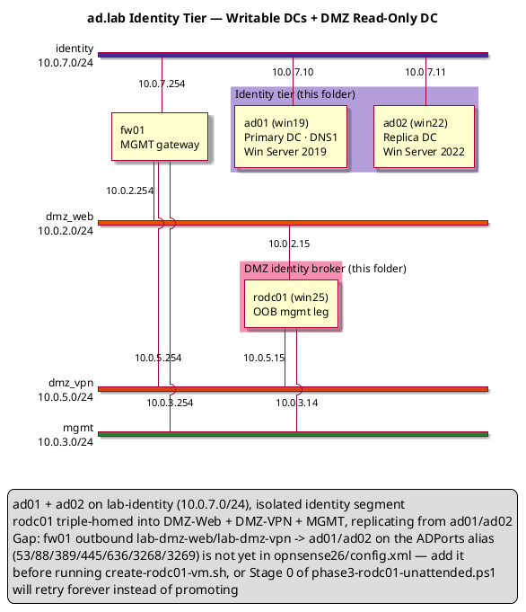

# ad.lab Domain Controllers — Phase 3 Reference Guide

## Forest Root + Replica DC + DMZ Read-Only DC, Fully Unattended

---

## 1. Overview

Phase 3 stands up the identity tier for the ad.lab domain: a forest-root DC (ad01), a replica DC (ad02) for redundancy and load distribution, and a read-only DC (rodc01) that carries authentication into the DMZ tiers without ever placing a writable DC there. Phase 4 (PKI, `../pki/README.md`) and Phase 5/6 (services, DMZ) build on top of this tier.

| Component   | Hostname    | IP Address                                             | Role                                     | OS                            |
| ----------- | ----------- | -------------------------------------------------------- | ----------------------------------------- | ------------------------------ |
| Primary DC  | ad01.ad.lab | 10.0.7.10                                                 | Forest root, AD DS, DNS1                  | Windows Server 2019 Core       |
| Replica DC  | ad02.ad.lab | 10.0.7.11                                                 | Replica DC, AD DS, DNS secondary          | Windows Server 2022 Core       |
| DMZ Read-Only DC | rodc01.ad.lab | 10.0.2.15 (DMZ-Web) / 10.0.5.15 (DMZ-VPN) / 10.0.3.14 (MGMT) | Read-only replica, DNS (RO), auth broker for DMZ tiers | Windows Server 2025 Core |

| Setting          | Value    |
| ---------------- | -------- |
| Domain (FQDN)    | ad.lab   |
| NetBIOS name     | ADLAB    |
| Forest/Domain mode | WinThreshold (2016) |
| Network          | lab-identity (10.0.7.0/24) |
| Gateway          | 10.0.7.254 |

**This folder is fully self-contained and fully unattended.** Running `create-ad01-vm.sh` takes a blank VM all the way to a verified, promoted forest root with zero console interaction, `create-ad02-vm.sh` does the same for the replica once ad01 is up, and `create-rodc01-vm.sh` does the same for the DMZ read-only DC once either writable DC is up. Nobody needs to log into any guest at any point.

### 1.1 Quickstart — How to Run This

```
On the libvirt host, from inside dcs/:

  1. One-time check (Section 4):
     - Base ISOs present at the paths hardcoded in each create-*-vm.sh
     - ../win19/NetKVM/, ../win22/NetKVM/, and ../win25/NetKVM/ contain the
       VirtIO drivers
     - lab-identity, lab-dmz-web, lab-dmz-vpn, and lab-mgmt libvirt
       networks already defined
     - fw01 outbound rule: lab-dmz-web/lab-dmz-vpn -> ad01/ad02 on the
       ADPorts alias (53/88/389/445/636/3268/3269) — see Section 3's Gap
       note; rodc01 cannot promote without this
     - apt install p7zip-full genisoimage qemu-utils virtinst ovmf

  2. ./create-ad01-vm.sh
     Builds the ISO and launches ad01. The command itself now blocks for
     up to 60 minutes (--wait 60) while virt-install babysits Windows
     Setup's own install-time reboots — this is what keeps the VM from
     ending up shut off mid-install needing a manual `virsh start` (see
     2.5). Once it returns, ad01 is past OS install and running the AD DS
     promotion unattended in the background.
     Watch it with:  virt-viewer ad01
     Or tail it with: ssh into ad01 and
                       Get-Content C:\ProvisionState\ad01-unattended.log -Wait

     Wait for:  Get-Content C:\ProvisionState\ad01.stage  ->  2

  3. ./create-ad02-vm.sh
     Can be run immediately after Step 2 — ad02 just retries every 2 minutes
     until ad01 answers, no need to wait for Step 2 to finish first.
     Same --wait 60 behavior applies to the OS-install portion.

     Wait for:  Get-Content C:\ProvisionState\ad02.stage  ->  2

  4. ./create-rodc01-vm.sh
     Can also be run any time after Step 2 — rodc01 retries every 2 minutes
     until ad01 or ad02 answers. Same --wait 60 behavior applies to the
     OS-install portion. Requires the fw01 ACL prerequisite from Step 1 —
     without it, Stage 0 retries forever instead of promoting.

     Wait for:  Get-Content C:\ProvisionState\rodc01.stage  ->  2

  5. Verify (Section 8/9), e.g. from either writable DC:
       dcdiag /test:dns /test:replications /test:services /q
       repadmin /replsummary
     And from rodc01 specifically:
       Get-ADDomainController -Identity RODC01 | Select Name, IsReadOnly
```

That's the whole flow. Everything else in this document is *why* it works this way — the retry loops, the power-event policy, and the encoding gotcha in Section 7 are all already baked into the scripts, not extra steps you need to perform.

---

## 2. VM Creation

All three DCs are built the same way the rest of this repo builds Windows VMs: unattended OS install via `virt-install` + a rebuilt install ISO carrying a custom `autounattend.xml`, the VirtIO NetKVM driver, and a `Provision\` folder with the DC-promotion PowerShell script. Unlike the rest of the repo, **the answer files here are local to `dcs/`** (`ad01-autounattend.xml`, `ad02-autounattend.xml`, `rodc01-autounattend.xml`) instead of references to `../win19/autounattend.xml` / `../win22/autounattend.xml` / `../win25/autounattend.xml` — hostname (`AD01`/`AD02`/`RODC01`) and the final static IP(s) are baked straight into them, so there's no post-install rename/reboot step left to run by hand. Only the NetKVM driver folders are still pulled from `../win19/NetKVM`, `../win22/NetKVM`, and `../win25/NetKVM`, since those are just the shared vendor driver binaries, not answer-file references.

| Script                  | Answer file (local)         | Base ISO             | VM name | os-variant | Disk  | RAM    | vCPUs | NICs |
| ----------------------- | ---------------------------- | --------------------- | ------- | ---------- | ----- | ------ | ----- | ---- |
| `create-ad01-vm.sh`     | `ad01-autounattend.xml`      | Windows Server 2019   | ad01    | win2k19    | 50 GB | 2048 MB | 2     | 1 (lab-identity) |
| `create-ad02-vm.sh`     | `ad02-autounattend.xml`      | Windows Server 2022   | ad02    | win2k22    | 50 GB | 2048 MB | 2     | 1 (lab-identity) |
| `create-rodc01-vm.sh`   | `rodc01-autounattend.xml`    | Windows Server 2025   | rodc01  | win2k25    | 50 GB | 2048 MB | 2     | 3 (lab-dmz-web, lab-dmz-vpn, lab-mgmt) |

Requirements on the libvirt host: `p7zip-full`, `genisoimage`, `qemu-utils`, `virtinst`, `ovmf`.

```bash
apt install p7zip-full genisoimage qemu-utils virtinst ovmf
```

### 2.1 What the answer files bake in

`ad01-autounattend.xml` and `ad02-autounattend.xml` are forks of the `win19`/`win22` golden copies with three differences:

1. `ComputerName` is `AD01` / `AD02` directly — no `Rename-Computer` + reboot needed afterward.
2. The static IP is `10.0.7.10/24` / `10.0.7.11/24` on `lab-identity`, gateway `10.0.7.254` (ad02's DNS search order also points at ad01 first, itself second).
   - ad01's pre-promotion resolver is Cloudflare-only (`1.1.1.1`, `1.0.0.1`) rather than a DC address, since none exists yet at that point.
   - Upstream DNS for anything outside `ad.lab` is Cloudflare (`1.1.1.1` + `1.0.0.1`) on **both** DCs. This is set explicitly via `Set-DnsServerForwarder -IPAddress '1.1.1.1','1.0.0.1' -UseRootHint $false` in Stage 1 of each `phase3-ad0X-unattended.ps1`, rather than left to whatever `Install-ADDSForest`/`Install-ADDSDomainController -InstallDns` happens to inherit from the pre-promotion NIC resolver — ad02 in particular has no external addresses on its NIC to inherit from (its resolver list is the two DCs), so without this explicit step it would silently fall back to root hints and diverge from ad01. Verify with `Get-DnsServerForwarder` on either DC.
3. `FirstLogonCommands` gains two extra steps beyond the usual OpenSSH bootstrap:
   - copy `D:\Provision\phase3-ad0X-unattended.ps1` (staged onto the ISO by the `create-ad0X-vm.sh` script) to `C:\Provision\`
   - launch it once with `powershell.exe -File C:\Provision\phase3-ad0X-unattended.ps1`

That single launch is enough — the script re-arms itself via a scheduled task across every reboot the promotion process triggers. See Section 7.

`rodc01-autounattend.xml` follows the same three points, with two DMZ-specific differences covered in 2.4 below: it's triple-homed instead of single-homed, and its disk layout matches `msql25/sql01-autounattend.xml` (Server 2025), not `ad02-autounattend.xml` (Server 2022).

### 2.2 create-ad01-vm.sh

See `create-ad01-vm.sh` in this folder for the full script.

### 2.3 create-ad02-vm.sh

See `create-ad02-vm.sh` in this folder for the full script.

### 2.4 create-rodc01-vm.sh — triple-homed, Server 2025

See `create-rodc01-vm.sh` in this folder for the full script. Two things make it different from `create-ad01-vm.sh` / `create-ad02-vm.sh`:

- **Disk layout.** Windows Server 2025 setup rejects the 2-partition (EFI + Primary) layout `ad02-autounattend.xml` uses for Server 2022. `rodc01-autounattend.xml` instead forks the 3-partition (EFI + MSR + Primary) layout and product key from `msql25/sql01-autounattend.xml`, the other Server 2025 VM already in this repo.
- **Three NICs, matched by MAC, not by name.** rodc01 sits on `lab-dmz-web` (10.0.2.15), `lab-dmz-vpn` (10.0.5.15), and `lab-mgmt` (10.0.3.14) simultaneously — see Section 3's diagram. A generic `<Identifier>Ethernet</Identifier>` in the answer file is ambiguous once there's more than one virtio NIC, since enumeration order at first boot isn't guaranteed. `create-rodc01-vm.sh` pins three fixed MAC addresses on the `virt-install` command line:

  | NIC | Network | MAC | Static IP |
  | --- | ------- | --- | --------- |
  | 1 | lab-dmz-web | `52:54:00:02:00:15` | 10.0.2.15/24 (default gateway 10.0.2.1) |
  | 2 | lab-dmz-vpn | `52:54:00:05:00:15` | 10.0.5.15/24 (route to 10.0.7.0/24 only — no default gateway) |
  | 3 | lab-mgmt    | `52:54:00:03:00:14` | 10.0.3.14/24 (OOB, no route) |

  `rodc01-autounattend.xml`'s TCPIP and DNS-Client `<Interface>` blocks use these same MACs as their `<Identifier>` values, so each NIC gets the right static IP on first boot with no post-boot NIC-by-MAC reshuffle needed — unlike `dmz/phase6-web01.ps1`, which has to do that reshuffle in-guest because its answer file predates using MAC as the `<Identifier>`. If you ever change a MAC in one file, change it in the other too, or the IP assignment silently lands on the wrong NIC (or none at all).

  Only NIC 1 (DMZ-Web) carries a default route. NIC 2 (DMZ-VPN) gets a host route to `10.0.7.0/24` only, so it can't become a second default gateway or a path into DMZ-Web — `nets/README.md` already documents that DMZ_VPN must not reach DMZ_WEB. NIC 3 (MGMT) is a pure OOB leg with no route at all, matching vpn01/waf01/lb01's MGMT legs.

### 2.5 Why `--wait 60` is on the `virt-install` call

For a multistep install (`--cdrom`, as both these scripts use), `virt-install` documents this exact behavior: once the install phase completes, the VM ends up **shut off — regardless of whether Windows itself requested a reboot along the way** — unless the `virt-install` process itself stays alive to manage those reboots. With plain `--noautoconsole`, the command kicks off the install and exits immediately, so nothing is left watching, and Windows Setup's normal file-copy → specialize → oobeSystem reboot chain leaves the VM sitting in `shut off` state needing a manual `virsh start` to continue. (This is a documented `virt-install`/`--noautoconsole` behavior, not a libvirt `on_reboot`/`on_poweroff` policy issue — an earlier revision of this doc misattributed it to the latter and tried to fix it with `--events on_poweroff=restart`, which the `qemu` driver actually rejects outright as an unsupported `on_reboot`/`on_poweroff` combination.)

The fix is `--wait`, which both scripts now pass as `--wait 60`: it keeps `virt-install` running (compatible with `--noautoconsole`) for up to 60 minutes, during which it manages the install-time reboots itself. Once Windows Setup's own install phase is complete, `virt-install` exits and the domain reverts to plain libvirt defaults (`on_reboot=restart`, `on_poweroff=destroy`) — which already do exactly the right thing for everything that happens afterward: the AD DS promotion reboot auto-resumes on its own (default `on_reboot=restart`), and a later deliberate shutdown actually sticks (default `on_poweroff=destroy`). No revert step needed, because nothing was overridden for the steady state to begin with.

60 minutes is generous for a Server Core install; if it's ever genuinely stuck past that, `--wait` simply times out and exits, leaving the VM in whatever state it's in — same fallback as before (`virsh domstate` / `virsh start`).

---

## 3. Network Diagram

ad01/ad02 sit on the isolated `lab-identity` segment (`10.0.7.0/24`, gateway `10.0.7.254`, static-only, no DHCP). rodc01 is triple-homed instead — DMZ-Web (`10.0.2.15`), DMZ-VPN (`10.0.5.15`), and MGMT (`10.0.3.14`) — with no leg on `lab-identity` itself; it reaches ad01/ad02 only through fw01-routed traffic. The diagram below (adapted from `general-nw.puml`) shows the architecture this folder now builds: an ACL-gated Identity/PKI network with a read-only DC (rodc01) exposing authentication to the DMZ tiers without placing a writable DC there.



See `general-nw.puml` for the full lab topology (WAN, DMZ-Web, DMZ-VPN, Identity/PKI, MGMT) that this tier plugs into.

---

## 4. Prerequisites

Before running any of the three scripts:

- The base ISOs (`ORIG_ISO` in each `create-*-vm.sh`) must exist at the paths hardcoded at the top of the script — edit those paths if your download location differs.
- `../win19/NetKVM/`, `../win22/NetKVM/`, and `../win25/NetKVM/` must contain the VirtIO NetKVM driver set (`w2k19`/`w2k22`/`2k25` or `w2k22` fallback, `amd64`) — see the `ERROR` messages in each script for the download source.
- `p7zip-full`, `genisoimage`, `qemu-utils`, `virtinst`, `ovmf` installed on the libvirt host (Section 2).
- The `lab-identity` libvirt network must already exist (`../nets/lab-identity.xml`) for ad01/ad02. `lab-dmz-web`, `lab-dmz-vpn`, and `lab-mgmt` (`../nets/lab-dmz-web.xml`, `lab-dmz-vpn.xml`, `lab-mgmt.xml`) must already exist for rodc01.
- **rodc01 only:** fw01 needs an outbound allow rule from `lab-dmz-web` and `lab-dmz-vpn` to ad01/ad02 (`10.0.7.10`, `10.0.7.11`) on the `ADPorts` alias (`53/88/389/445/636/3268/3269`) — the same alias `opnsense26/config.xml` already uses for the inbound DMZ-Web→RODC rule, just missing the reverse direction. This is the gap called out in Section 3. Without it, `phase3-rodc01-unattended.ps1` Stage 0 retries every 2 minutes indefinitely instead of promoting.
- Nothing else — no DSRM password, no domain credentials, no manual OS knowledge is needed at run time. All three are hardcoded lab-only defaults (`Server2012!`) inside `phase3-ad01-unattended.ps1` / `phase3-ad02-unattended.ps1` / `phase3-rodc01-unattended.ps1`, matching this repo's existing convention (Section 7.3).

---

## 5. Run Order

```
Step 0  host  ./create-ad01-vm.sh     Unattended OS install for ad01 (Windows Server 2019 Core).
                                       No further action needed: FirstLogonCommands in
                                       ad01-autounattend.xml stage and launch
                                       phase3-ad01-unattended.ps1, which installs AD DS + DNS
                                       and promotes ad01 as forest root for ad.lab, rebooting
                                       and resuming on its own until verified.

                                       Wait for C:\ProvisionState\ad01.stage to reach 2
                                       (or tail C:\ProvisionState\ad01-unattended.log) before
                                       moving to Step 1.

Step 1  host  ./create-ad02-vm.sh     Unattended OS install for ad02 (Windows Server 2022 Core).
                                       No further action needed: FirstLogonCommands in
                                       ad02-autounattend.xml stage and launch
                                       phase3-ad02-unattended.ps1, which waits for ad01 to
                                       answer (retrying every 2 minutes with no manual rerun),
                                       installs AD DS, and promotes ad02 as a replica DC,
                                       rebooting and resuming on its own until verified.

                                       Can be run any time after Step 0 — even immediately,
                                       since ad02 will simply keep retrying until ad01 is
                                       reachable. C:\ProvisionState\ad02.stage reaches 2 once
                                       replication is verified.

Step 2  host  ./create-rodc01-vm.sh  Unattended OS install for rodc01 (Windows Server 2025
                                       Core, triple-homed DMZ-Web/DMZ-VPN/MGMT). No further
                                       action needed: FirstLogonCommands in
                                       rodc01-autounattend.xml stage and launch
                                       phase3-rodc01-unattended.ps1, which waits for ad01 or
                                       ad02 to answer (retrying every 2 minutes with no
                                       manual rerun), installs AD DS, and promotes rodc01 as
                                       a read-only replica DC, rebooting and resuming on its
                                       own until verified.

                                       Requires the fw01 ACL prerequisite from Section 4 —
                                       without it this retries forever instead of promoting.
                                       Can otherwise be run any time after Step 0 or Step 1.
                                       C:\ProvisionState\rodc01.stage reaches 2 once
                                       verified.
```

That's the entire flow — from three blank VMs to a forest root, a replica, and a DMZ read-only DC, all replicating, with no console login, no `Get-Credential` prompt, and no manual rename/IP/reboot step on any guest.

---

## 6. Scripts

### 6.1 phase3-ad01-unattended.ps1 — forest root, no prompts

Launched once by `ad01-autounattend.xml`'s `FirstLogonCommands`. Hostname and static IP are already baked into the answer file, so this only has to install AD DS/DNS and promote — it survives the promotion reboot via a `SYSTEM` scheduled task keyed off a stage file. Stage 1 also polls for the DNS role and ADWS to actually be queryable before touching either, rather than assuming they're up the instant the reboot completes — see Section 7.6.

See `phase3-ad01-unattended.ps1` in this folder for the full script.

### 6.2 phase3-ad02-unattended.ps1 — replica DC, no prompts

Launched once by `ad02-autounattend.xml`'s `FirstLogonCommands`. Waits for ad01 on a 2-minute repeating scheduled-task timer (not just `AtStartup`), so it needs no manual rerun even if ad01 isn't up yet when ad02 finishes installing. Stage 1 also polls for the DNS role and ADWS before using either — see Section 7.6.

See `phase3-ad02-unattended.ps1` in this folder for the full script.

### 6.3 phase3-rodc01-unattended.ps1 — read-only replica DC, no prompts

Launched once by `rodc01-autounattend.xml`'s `FirstLogonCommands`. Same wait/retry/reboot-persistence structure as `phase3-ad02-unattended.ps1` — a 2-minute repeating scheduled-task timer, a `C:\ProvisionState\rodc01.stage` file, Stage 1 polling for the DNS role and ADWS — but Stage 0 checks connectivity to **either** ad01 or ad02 (not just one) before proceeding, and promotes with `Install-ADDSDomainController -ReadOnlyReplica -InstallDns` instead of a plain replica promotion. Stage 1 additionally asserts `Get-ADDomainController -Identity RODC01 | Select IsReadOnly` is `$true` before marking itself verified, and prints a reminder that Password Replication Policy (which accounts/groups this RODC is allowed to cache passwords for) is a manual follow-up — an RODC caches none by default.

See `phase3-rodc01-unattended.ps1` in this folder for the full script.

---

## 7. Unattended DC Promotion — How It Works

The two scripts above are fully unattended — no logon, no `Get-Credential` prompt, no manual reboot/rerun. This section documents the mechanics so the pattern is easy to extend to future phases.

### 7.1 Background: what happened to `dcpromo /unattend`?

Pre-2012 Windows Server supported a `dcpromo.exe` answer file (`[DCInstall]` section in an `unattend.txt`). `dcpromo.exe` itself is removed as of Windows Server 2012+; its unattended-install successor is simply calling `Install-ADDSForest` / `Install-ADDSDomainController` with every parameter supplied and no `Get-Credential`/`Read-Host` calls left in the script. That's the modern "answer file" — there's no separate DC-specific XML schema to author.

### 7.2 What used to block unattended execution, and how it's solved here

| Blocker | Cause | Fix used in this folder |
| ------- | ----- | --- |
| Rename + reboot | `Rename-Computer` requires a restart before AD DS setup can proceed | Eliminated — `ComputerName` is baked into `ad0X-autounattend.xml`'s / `rodc01-autounattend.xml`'s `specialize` pass, so the guest is already named `AD01`/`AD02`/`RODC01` at first boot |
| Static IP configuration | Doing it via `New-NetIPAddress` needs a login session | Eliminated — the TCP/IP and DNS-Client components in the `specialize` pass set it during OS install. rodc01 has three NICs, so its `<Interface>` blocks are matched by MAC address instead of the generic `Ethernet` name ad0X uses — see 2.4 |
| Reboot after promotion | `Install-ADDSForest`/`Install-ADDSDomainController` reboot on completion | A `SYSTEM` scheduled task (`AtStartup`) re-launches the same `phase3-*-unattended.ps1` at every boot, tracked by a `C:\ProvisionState\*.stage` file, until the verification stage is reached |
| ad02/rodc01 need a writable DC up first | No inherent ordering guarantee between the VM-creation scripts | `phase3-ad02-unattended.ps1`'s and `phase3-rodc01-unattended.ps1`'s scheduled tasks also carry a 2-minute repeating trigger, so they retry connectivity to ad01 (ad02) or ad01/ad02 (rodc01) on their own without needing a reboot or a human to rerun anything |
| Interactive credential prompt (ad02, rodc01) | `Get-Credential` blocks until a human types a password | `Get-DomainCredential` in `phase3-ad02-unattended.ps1` / `phase3-rodc01-unattended.ps1` supplies a `PSCredential` built from a stored secret instead — see 7.3 |
| DNS role / ADWS not ready right after reboot | `Set-DnsServerForwarder` and every `Get-AD*` cmdlet depend on WMI/CIM providers (DNS Server role, Active Directory Web Services) that can take longer to initialize than the service itself reporting "Running" | All three scripts poll (`Get-DnsServerForwarder` / `Get-ADRootDSE`, 12 × 5s) before touching either — see 7.6 |
| VM shuts off mid-install instead of continuing | `virt-install`'s documented behavior for a multistep (`--cdrom`) install with `--noautoconsole`: it exits immediately after kicking off the install, so nothing is left to manage the reboots Windows Setup issues along the way | `create-ad0X-vm.sh` / `create-rodc01-vm.sh` pass `--wait 60` to `virt-install`, keeping it alive to babysit the install-time reboots — see 2.5 |
| `phase3-ad01-unattended.ps1` fails to parse (`Unexpected token '}'`) | Windows PowerShell 5.1 doesn't reliably auto-detect BOM-less UTF-8; the script's em-dash/box-drawing comment characters get misread under the system codepage, desyncing the parser | All `phase3-*-unattended.ps1` files are checked in with a UTF-8 BOM — see 7.7 |
| DMZ tiers must never reach a writable DC directly | Placing ad01/ad02 in a DMZ subnet would expose the whole domain if any DMZ host were compromised | rodc01 promotes with `-ReadOnlyReplica`: it only ever pulls replication inbound from ad01/ad02, never pushes writes back, and caches no passwords by default (Password Replication Policy is a deliberate manual opt-in — see 6.3) |

### 7.3 Credential handling without a prompt

Two options, in increasing order of safety:

- **Plaintext in the script** (`ConvertTo-SecureString -AsPlainText`) — what all three scripts use by default, consistent with this repo's existing convention of a plaintext DSRM password (`Server2012!`) throughout Phase 3 and Phase 4. Fine for an isolated, disposable lab; not something to carry into anything internet-facing.
- **DPAPI-encrypted credential file** (`Export-Clixml` / `Import-Clixml`) — encrypt once, interactively, under the same local account and machine that will later decrypt it. Not portable between machines or accounts, but keeps the password out of the script body and off disk in plaintext. Commented-out in `Get-DomainCredential` in `phase3-ad02-unattended.ps1` and `phase3-rodc01-unattended.ps1` — uncomment and remove the plaintext block above it to switch.

### 7.4 Reboot persistence pattern

`phase3-ad01-unattended.ps1`, `phase3-ad02-unattended.ps1`, and `phase3-rodc01-unattended.ps1` all use the same pattern:

1. A small integer in `C:\ProvisionState\<host>.stage` tracks progress (0 = not started, 1 = promoted [ad01] / promotion attempted [ad02, rodc01], 2 = verified).
2. A scheduled task (`SYSTEM`, no logon required) re-invokes the same script file — on ad01 at every startup; on ad02 and rodc01 at every startup *and* every 2 minutes, since both also have to wait on an external dependency (a writable DC being reachable) rather than just a local reboot.
3. The script reads its stage, does the next piece of work, advances the stage, and either exits (letting the next trigger pick it back up after a reboot Windows itself will do) or — once verified — unregisters its own task and stops.

### 7.5 How the OS-level autounattend.xml kicks it all off

`ad01-autounattend.xml`, `ad02-autounattend.xml`, and `rodc01-autounattend.xml` all chain straight into this from `FirstLogonCommands`:

```xml
<SynchronousCommand wcm:action="add">
  <Order>4</Order>
  <CommandLine>cmd.exe /c if not exist C:\Provision mkdir C:\Provision &amp; copy /Y D:\Provision\phase3-ad01-unattended.ps1 C:\Provision\phase3-ad01-unattended.ps1</CommandLine>
  <Description>Stage AD DS promotion script from install media to C:\Provision</Description>
  <RequiresUserInput>false</RequiresUserInput>
</SynchronousCommand>
<SynchronousCommand wcm:action="add">
  <Order>5</Order>
  <CommandLine>powershell.exe -NonInteractive -ExecutionPolicy Bypass -File "C:\Provision\phase3-ad01-unattended.ps1"</CommandLine>
  <Description>Bootstrap unattended forest-root promotion (ad01)</Description>
  <RequiresUserInput>false</RequiresUserInput>
</SynchronousCommand>
```

(`create-ad0X-vm.sh` stages `phase3-ad0X-unattended.ps1` onto the rebuilt ISO's `Provision\` folder — the same media used for the `NetKVM` drivers — since `FirstLogonCommands` run before any network share you'd normally copy it from is guaranteed reachable. The `D:` drive letter matches the `D:\NetKVM` driver path already used in the `windowsPE` pass, since the CD-ROM stays attached to the guest as `D:` through first boot.)

The full chain, blank disk to promoted/verified DC, is: OS install → first boot (autologon) → OpenSSH bootstrap → copy promotion script to `C:\Provision` → launch it → install AD DS/DNS → promote → reboot (ad01) or wait-then-promote-then-reboot (ad02) → verify → scheduled task deletes itself.

### 7.6 Post-reboot race conditions: DNS role and ADWS readiness

Both scripts' Stage 1 depends on two Windows services that a promotion reboot brings up, but neither is guaranteed to be *queryable* the instant the service shows `Running`:

- **DNS Server role** — `Set-DnsServerForwarder` talks to the DNS Server WMI/CIM provider. Right after boot this can throw `WIN32 1722` ("Failed to get information for server AD0X" / RPC server unavailable) even though the `DNS` service itself is already up.
- **Active Directory Web Services (ADWS)** — every `Get-AD*` cmdlet (`Get-ADDomain`, `Get-ADForest`, `Get-ADDomainController`, ...) depends on it, and it routinely takes longer to initialize than the DNS role, especially on modestly-resourced VMs. The failure mode is `Unable to find a default server with Active Directory Web Services running`.

Both scripts handle this the same way: poll the relevant cmdlet (`Get-DnsServerForwarder` for the DNS role, `Get-ADRootDSE` as a lightweight ADWS probe) every 5 seconds, up to 12 tries (60 seconds), before running the real command. If neither comes up in that window, the script throws a clear, specific error instead of leaving a cryptic CIM exception in the transcript. This is the same retry-until-ready pattern used for the reboot-persistence loop in 7.4, just scoped to a single stage rather than a whole reboot cycle.

### 7.7 UTF-8 BOM required for PowerShell 5.1

Both `phase3-ad0X-unattended.ps1` scripts contain a handful of em-dash (`—`) and box-drawing (`──`) characters in comments and one `Write-Host` string. Windows PowerShell 5.1 (the version on Server Core 2019/2022) doesn't reliably auto-detect BOM-less UTF-8 files passed to `-File` — it can fall back to the system's ANSI codepage instead, corrupting those multi-byte characters and, in the worst case, desyncing the parser badly enough to throw `Unexpected token '}' in expression or statement` at a completely unrelated line (typically the next closing brace after the corruption).

Both scripts as checked into this repo now carry a UTF-8 BOM, so this isn't a step you need to perform — it's noted here only so the cause is documented if it's ever reintroduced (e.g. a future edit saved from a tool that strips the BOM). If you ever do hit that parse error, the fix is to open the file in Notepad and save it (Notepad writes UTF-8 with BOM by default on Windows 10+), or convert it explicitly:

```powershell
$path = "C:\Provision\phase3-ad01-unattended.ps1"
$content = Get-Content $path -Raw
[System.IO.File]::WriteAllText($path, $content, [System.Text.UTF8Encoding]::new($true))
```

---

## 8. Verification Results

| Test                          | Result | Command                                   |
| ------------------------------ | ------ | ------------------------------------------ |
| Forest created                 | PASS   | `Get-ADForest`                              |
| Domain created                 | PASS   | `Get-ADDomain`                              |
| ad01 is Global Catalog + FSMO  | PASS   | `Get-ADDomainController`, `netdom query fsmo` |
| DNS zone `ad.lab` AD-integrated| PASS   | `Get-DnsServerZone`                         |
| Forwarders = Cloudflare only (ad01 + ad02 + rodc01) | PASS | `Get-DnsServerForwarder`        |
| ad02 replica promoted          | PASS   | `Get-ADDomainController -Filter *`          |
| rodc01 promoted read-only      | PASS   | `Get-ADDomainController -Identity RODC01 \| Select IsReadOnly` |
| Replication healthy (all three)| PASS   | `repadmin /replsummary`                     |
| DCDiag clean (all three)       | PASS   | `dcdiag /test:dns /test:replications /test:services /q` |
| rodc01 reachable on DMZ-Web (10.0.2.15) and DMZ-VPN (10.0.5.15) legs | PASS | `Test-NetConnection <ip> -Port 389` from web01/vpn01 |
| Password Replication Policy    | NOT CONFIGURED (expected) | `Get-ADDomainControllerPasswordReplicationPolicy RODC01` — deliberate manual follow-up, see 6.3 |

---

## 9. Quick Reference

### Key commands

| Command                                              | Run on        | Purpose                          |
| ----------------------------------------------------- | ------------- | --------------------------------- |
| `Get-ADDomain`                                        | any of the three | Domain info                    |
| `Get-ADForest`                                        | ad01          | Forest info                       |
| `Get-ADDomainController -Filter *`                    | any of the three | List all DCs, incl. `IsReadOnly` |
| `Get-ADDomainController -Identity RODC01 \| Select IsReadOnly` | ad01, ad02, or rodc01 | Confirm rodc01 came up read-only |
| `Get-ADDomainControllerPasswordReplicationPolicy RODC01` | ad01 or ad02 | Check/set which accounts rodc01 may cache passwords for (6.3) |
| `repadmin /replsummary`                               | any of the three | Replication health             |
| `repadmin /showrepl`                                  | any of the three | Detailed replication status    |
| `dcdiag /test:dns /test:replications /test:services /q` | any of the three | Full DC health check         |
| `Get-DnsServerForwarder`                              | any of the three | Confirm upstream DNS = Cloudflare (1.1.1.1, 1.0.0.1) |
| `netdom query fsmo`                                   | ad01          | FSMO role holders                 |
| `Get-ScheduledTask Phase3-*-Continue`                 | any of the three | Check unattended-flow task status |
| `Get-Content C:\ProvisionState\*.stage`               | any of the three | Check unattended-flow progress   |
| `Get-Content C:\ProvisionState\*-unattended.log -Wait`| any of the three | Tail the unattended-flow transcript |

### Important file locations

**On the libvirt host (this folder):**

| Path                          | Contents                                                |
| ------------------------------ | -------------------------------------------------------- |
| `ad01-autounattend.xml`        | Custom answer file for ad01 (hostname, IP, promotion bootstrap baked in) |
| `ad02-autounattend.xml`        | Custom answer file for ad02 (hostname, IP, promotion bootstrap baked in) |
| `rodc01-autounattend.xml`      | Custom answer file for rodc01 (hostname, three MAC-matched IPs, promotion bootstrap baked in) |
| `phase3-ad01-unattended.ps1`   | Forest-root promotion script, staged onto ad01's install media |
| `phase3-ad02-unattended.ps1`   | Replica-DC promotion script, staged onto ad02's install media |
| `phase3-rodc01-unattended.ps1`| Read-only replica DC promotion script, staged onto rodc01's install media |
| `create-ad01-vm.sh`            | Builds ad01's unattended ISO and launches the VM         |
| `create-ad02-vm.sh`            | Builds ad02's unattended ISO and launches the VM         |
| `create-rodc01-vm.sh`          | Builds rodc01's unattended ISO and launches the VM (3 pinned-MAC NICs) |

**On each guest:**

| Path                                 | VM                  | Contents                                  |
| ------------------------------------- | ------------------- | ------------------------------------------ |
| `C:\Provision\phase3-*-unattended.ps1`| ad01, ad02, rodc01  | Copy of the promotion script staged from the install media |
| `C:\ProvisionState\*.stage`           | ad01, ad02, rodc01  | Unattended-flow progress marker (0/1/2)   |
| `C:\ProvisionState\*-unattended.log`  | ad01, ad02, rodc01  | Transcript of the unattended run          |
| `C:\ProvisionState\ad02-cred.xml`     | ad02 (optional)     | DPAPI-encrypted domain credential (7.3, option B) |
| `C:\ProvisionState\rodc01-cred.xml`   | rodc01 (optional)   | DPAPI-encrypted domain credential (7.3, option B) |

---

_ad.lab Phase 3 Reference Guide — September 2026_
